# Raft博士论文翻译

<!-- TOC -->

- [Raft博士论文翻译](#raft博士论文翻译)
    - [1 介绍](#1-介绍)
    - [2 动机](#2-动机)
        - [2.1 使用复制状态机实现容错](#21-使用复制状态机实现容错)
        - [2.2 复制状态机的常见用例](#22-复制状态机的常见用例)
        - [2.3 Paxos 怎么了](#23-paxos-怎么了)
    - [4 集群成员变更](#4-集群成员变更)
        - [4.1 安全](#41-安全)
        - [4.2 可用性](#42-可用性)
            - [4.2.1 让新服务器追赶](#421-让新服务器追赶)
            - [4.2.2 删除当前领导者](#422-删除当前领导者)
            - [4.2.3 破坏性服务器](#423-破坏性服务器)
            - [4.2.4 可用性参数](#424-可用性参数)
        - [4.3 使用联合共识进行任意配置变更](#43-使用联合共识进行任意配置变更)
        - [4.4 系统集成](#44-系统集成)
        - [4.5 结论](#45-结论)
    - [5 日志压缩](#5-日志压缩)
        - [5.1 基于内存的状态机快照](#51-基于内存的状态机快照)
            - [5.1.1 并发拍摄快照](#511-并发拍摄快照)
            - [5.1.2 何时拍摄快照](#512-何时拍摄快照)
            - [5.1.3 实现问题](#513-实现问题)
        - [5.2 基于磁盘的状态机快照](#52-基于磁盘的状态机快照)
        - [5.3 增量清理方法](#53-增量清理方法)
            - [5.3.1 日志清理基础](#531-日志清理基础)
            - [5.3.2 日志结构合并树基础](#532-日志结构合并树基础)
            - [5.3.3 Raft 中的日志清理和日志结构化合并树](#533-raft-中的日志清理和日志结构化合并树)
        - [5.4 备选方案：基于领导者的方法](#54-备选方案基于领导者的方法)
            - [5.4.1 将快照存储在日志中](#541-将快照存储在日志中)
            - [5.4.2 对于非常小的状态机使用基于领导者的方法](#542-对于非常小的状态机使用基于领导者的方法)
        - [5.5 结论](#55-结论)

<!-- /TOC -->

## 1 介绍

当今的数据中心系统和应用程序在高度动态的环境中运行。它们通过利用额外服务器的资源横向扩展，并根据需求扩展和收缩。服务器和网络故障也很常见：每年约有 2-4% 的磁盘驱动器发生故障，服务器崩溃的频率与之相当，在现代数据中心中，每天都有数十个网络链接失败。

因此，系统必须在正常操作期间处理服务器的上下线。他们必须对变故做出反应并在几秒钟内自动适应；对客户来说明显的中断通常是不可接受的。这是当今系统中的主要挑战；在这种动态环境中，故障处理，协调，服务发现和配置管理都很困难。

幸运的是，分布式共识可以帮助应对这些挑战。共识允许一组机器作为一个一致的组来工作，这些组可以承受某些成员的故障。在一个达成共识的团队中，故障是用一种有原则的、行之有效的方式来处理的。由于共识组具有很高的可用性和可靠性，所以其他系统组件可以使用共识组作为自身容错的基础。因此，共识在构建可靠的大规模软件系统中起着关键作用。

当我们开始这项工作时，达成共识的需求变得越来越明显，但是许多系统仍在努力解决共识可以解决的问题。一些大型系统仍然受到单个协调服务器作为单点故障的限制（例如，HDFS）。许多其他方法包括不安全地处理故障的特殊复制算法（例如，MongoDB 和 Redis）。新系统几乎没有可供选择的现成共识实现方式（ZooKeeper 是最受欢迎的），这迫使系统构建者要么遵从一个，要么构建一个自己的一致实现。

那些选择实现共识的人通常会参考 Paxos。在过去的二十年中，Paxos 主宰了共识的讨论：共识的大多数实现都基于 Paxos 或受其影响，并且 Paxos 已成为用于向学生传授共识的主要工具。

不幸的是，尽管有很多尝试使 Paxos 变得更加平易近人，但它还是很难理解。此外，其体系结构需要进行复杂的更改以支持实际系统，并且基于 Paxos 构建完整的系统需要开发一些扩展，而这些扩展的详细信息尚未发布或未得到商定。结果，系统构建者和学生都在Paxos 中挣扎。

另外两个著名的共识算法是 Viewstamped Replication 和 Zab，ZooKeeper 中使用的算法。尽管我们认为这两种算法在结构上都比 Paxos 更好，但都没有明确提出这一论点。它们的设计并非以简单或易于理解为主要目标。理解和实现这些算法的负担仍然过高。

这些共识算法中的每一个都难以理解且难以实施。不幸的是，当用公认的算法来实现共识的成本太高时，系统构建者就不得不做出艰难的决定。他们可能会完全避免达成共识，从而牺牲其系统的容错性或一致性，或者他们可能会开发自己的特殊算法，从而可能导致不安全的行为。而且，当解释和理解共识的成本太高时，并不是所有的教师都试图教授它，也不是所有的学生都能成功地学习它。共识与两阶段提交一样重要。理想情况下，应有尽可能多的学生学习（即使从根本上来说，学习共识更为困难）。

在与 Paxos 斗争之后，我们着手寻找一种新的共识算法，该算法可以为系统构建和教育提供更好的基础。我们的方法与众不同，因为我们的主要目标是可理解性：我们可以为实际系统定义一个一致的算法，并以一种比 Paxos 更容易学习的方式来描述它吗？此外，我们希望该算法能够帮助系统构建者开发至关重要的直觉。重要的不仅是算法能起作用，还有它为什么很明显能起作用。

该算法还必须足够完整，以解决构建实际系统的所有方面，并且必须在实际部署时表现良好。核心算法不仅必须指定接收消息的效果，还必须描述应该发生什么以及何时发生。这些对于系统构建者同样重要。同样，它必须保证一致性，并且还必须尽可能提供可用性。它还必须解决超出达成共识系统的许多方面，例如更改共识组的成员。这在实践中是必要的，将这个负担留给系统构建者将会有特别的、次优的甚至不正确的解决方案的风险。

这项工作的结果是一个称为 Raft 的共识算法。在设计 Raft 时，我们应用了特定的技术来提高可理解性，包括分解（Raft 分离了领导者选举，日志复制和安全性）和状态空间缩减（Raft 减少了不确定性的程度以及服务器彼此之间不一致的方式）。我们还解决了构建基于共识的完整系统所需的所有问题。我们仔细考虑了每个设计选择，不仅是为了自己的实现，还为了我们希望实现的许多其他设计。

我们认为，无论是出于教育目的还是作为实现的基础，Raft 都优于 Paxos 和其他共识算法。它比其他算法更简单，更容易理解；它的描述完全能够满足实际系统的需要；它有几个开源实现并被一些公司使用；其安全性能已被正式规定和证明；其效率与其他算法相当。

本文的主要贡献如下：

* Raft 共识算法的设计，实现和评估。 Raft 在许多方面都与现有的共识算法（最著名的是 Oki 和 Liskov 的 Viewstamped复制）相似，但其设计目的是为了易于理解。这导致了几种新颖的功能。例如，与其他共识算法相比，Raft 使用了一种更强大的领导形式。这简化了日志复制的管理，并使 Raft 更易于理解。
* 对 Raft 的可理解性进行评估。一项对两所大学的 43 名学生进行的用户研究表明，Raft 比 Paxos 更容易理解：学习了这两种算法后，其中 33 名学生能够更好地回答有关 Raft 而不是 Paxos 的问题。我们相信这是第一个基于教学来评估一致性算法的科学研究。
* Raft 领导者选举机制的设计，实现和评估。尽管许多共识算法未规定特定的领导者选举算法，但 Raft 包含了一种涉及随机计时器的特定算法。这可以为任何共识算法已经要求的心跳添加少量机制，同时可以轻松，快速地解决冲突。对领导者选举的评估考察了它的行为和性能，得出结论，这种简单的方法在广泛的实际环境中是足够的。它通常在集群的单向网络延迟的 20 倍以内选出一个领导者。
* Raft 集群成员更改机制的设计和实现。Raft 允许一次添加或删除单个服务器；这些操作简单地保持了安全性，因为更改期间至少有一台服务器与大多数服务器重叠。成员中更复杂的更改可以通过一系列单服务器更改来实现。Raft 允许集群在更改期间继续正常运行，并且成员更改可以通过对基本共识算法的一些扩展来实现。
* 一个完整的基于共识的系统所需的其他组件的详细讨论和实现，包括客户端交互和日志压缩。尽管我们不认为 Raft 的这些方面特别新颖，但是完整的描述对于可理解性和使他人能够构建实际系统很重要。我们已经实现了一个完整的基于共识的服务，以探索和处理所有涉及的设计决策。
* Raft 算法的安全性和正式规范的证明。正式规范中的精度级别有助于对算法进行仔细的推理，并在算法的非正式描述中澄清细节。安全性的证明有助于建立对 Raft 正确性的信心。它还帮助那些希望扩展 Raft 的人，阐明扩展对安全性的影响。

我们已经在一个称为 LogCabin 的 Raft 开源实现中实现了本文中的许多设计。LogCabin 是我们对于 Raft 新想法的测试平台，并且是一种验证我们是否了解构建完整且实用的系统的方法。该实现在第 10 章中有更详细的描述。

本文的其余部分介绍了复制状态机问题，并讨论了 Paxos 的优缺点（第 2 章）。 介绍了 Raft 共识算法，它对集群成员更改和日志压缩的扩展，以及客户端如何与 Raft 交互（第 3-6 章）；评估 Raft 的可理解性，正确性，领导者选举和日志复制性能（第 7-10 章）；并讨论相关工作（第 11 章）。

## 2 动机

共识是可容错系统中的一个基本问题：即使面对故障，服务器如何在共享状态上达成一致？ 这个问题出现在需要提供高可用性且不能在一致性上妥协的各种系统中。因此，共识实际上几乎用于所有一致的大型存储系统中。第 2.1 节描述了通常如何使用共识来创建复制状态机，而复制状态机是容错系统的通用模块。第 2.2 节讨论了在大型系统中使用复制状态机的各种方式。第 2.3 节讨论了 Raft 旨在解决的 Paxos 共识协议的问题。

### 2.1 使用复制状态机实现容错

共识算法通常出现在复制状态机的环境中。在此过程中，服务器集合上的状态机计算相同状态的相同副本，即使某些服务器宕机，状态机也可以继续运行。复制状态机用于解决分布式系统中的各种容错问题，如第 2.2 节所述。复制状态机的示例包括 Chubby 和 ZooKeeper，它们都为少量的配置数据提供了分层的键值存储。除了诸如 get 和 put 之类的基本操作之外，它们还提供了诸如 compare-and-swap 之类的同步原语，从而使并发的客户端能够安全地协调工作。

复制状态机通常使用复制日志来实现，如图 2.1 所示。每个服务器存储一个包含一系列命令的日志，其状态机按顺序执行这些命令。每个日志以相同的顺序包含相同的命令，因此每个状态机处理相同的命令序列。由于状态机是确定性的，因此每个状态机都计算相同的状态和相同的输出序列。

>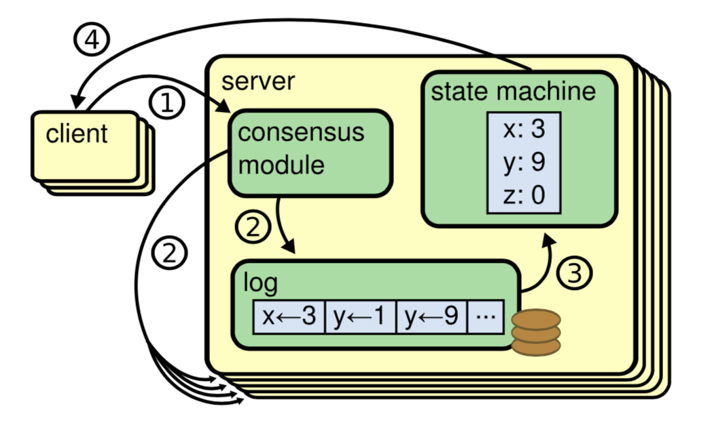
图 2.1：复制状态机架构。共识算法管理包含来自客户端的状态机命令的复制日志。 状态机处理来自日志的相同命令序列，因此它们产生相同的输出。

保持复制日志的一致性是共识算法的工作。 服务器上的共识模块从客户端接收命令并将它们添加到其日志中。它与其他服务器上的共识模块通信，以确保即使某些服务器发生故障，每个日志最终仍将以相同顺序包含相同的请求。一旦正确复制了命令，就称它们已提交。每个服务器的状态机均以日志顺序处理已提交的命令，并将输出返回给客户端。因此，服务器似乎形成了一个单独的，高度可靠的状态机。

实际系统的共识算法通常具有以下属性：
* 它们可确保在所有非拜占庭条件下的安全性（绝不会返回错误的结果），包括网络延迟，分区，数据包丢失，重复和重新排序。
* 只要任何大多数服务器都可以运行并且可以相互通信以及与客户端进行通信，它们就可以正常运行（可用）。因此，由五个服务器组成的典型集群可以容忍任何两个服务器的故障。假定服务器因停止而发生故障；它们稍后可能会从稳定存储上的状态中恢复并重新加入集群。
* 它们不依赖于时间来确保日志的一致性：错误的时钟和极端的消息延迟，在最坏的情况下，只可能会导致可用性问题。也就是说，它们可以在消息和处理器都以任意速度运行的异步模型下保持安全性。
* 在通常情况下，只要集群中的大多数服务器都响应了一次远程过程调用，命令就可以完成。少数运行缓慢的服务器不影响整体系统性能。

### 2.2 复制状态机的常见用例

复制状态机是使系统具有容错能力的通用构建块。它们可以以多种方式使用，本节讨论一些典型的使用模式。

大多数常见的共识部署都只用三到五台服务器形成一个复制状态机。然后其他服务器可以使用此状态机来协调其活动，如图 2.2（a）所示。这些系统通常使用复制的状态机来提供成员身份，配置管理或锁。作为一个更具体的示例，复制状态机可以提供容错工作队列，其他服务器可以使用复制状态机进行协调，以将工作分配给自己。

>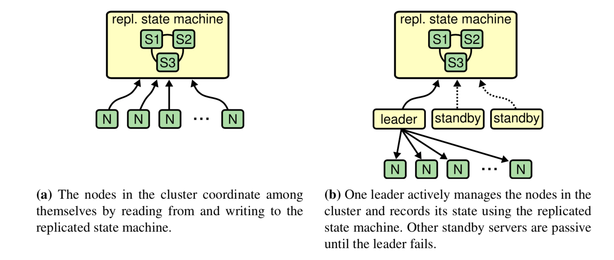
图 2.2：使用单个复制状态机的常见模式。

图 2.2（b）中显示了对此用法的常见简化。在这种模式下，一台服务器充当领导者，管理其余服务器。领导者将其关键数据存储在共识系统中。万一发生故障，其他备用服务器将争夺领导者的位置，如果成功，它们将使用共识系统中的数据继续操作。许多具有单个集群领导者的大型存储系统，例如 GFS，HDFS 和 RAMCloud，都使用这种方法。

有时也使用共识来复制大量数据，如图 2.3 所示。大型存储系统（例如 Megastore，Spanner 和 Scatter）存储的数据太多，无法容纳在一组服务器中。他们跨许多复制状态机对数据进行分区，并且对跨越多个分区的操作使用两阶段提交协议（2PC）来保持一致性。

>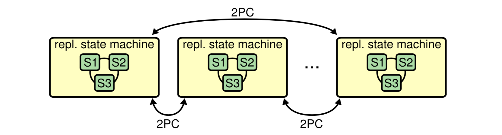
图 2.3：使用共识的大型分区存储系统。为了扩展，数据在许多复制状态机之间进行了分区。跨越分区的操作使用两阶段提交协议。

### 2.3 Paxos 怎么了

在过去的 10 年里，Leslie Lamport 的 Paxos 算法几乎已经成为一致性的代名词：Paxos 是在课程教学中最经常使用的算法，同时也是大多数一致性算法实现的起点。Paxos 首先定义了一个能够达成单一决策一致的协议，比如单条的复制日志项。我们把这一子集叫做单决策 Paxos。然后通过组合多个 Paxos 协议的实例来促进一系列决策的达成。图 2.4 总结了单决策 Paxos，图 A.5 总结了多决策 Paxos。Paxos 保证安全性和活性（假设使用了足够的故障检测器以避免提议者发生活锁，它最终会达成共识），并且其正确性得到了证明。在正常情况下，多决策 Paxos 是有效的，并且 Paxos 支持集群成员更改。

不幸的是，Paxos 有两个明显的缺点。第一个缺点是 Paxos 算法特别的难以理解。完整的解释是出了名的不透明；通过极大的努力之后，也只有少数人成功理解了这个算法。因此，有了几次用更简单的术语来解释 Paxos 的尝试。尽管这些解释都只关注了单决策的子集问题，但依然很具有挑战性。在 2012 年 NSDI 的会议中的一次调查显示，很少有人对 Paxos 算法感到满意，甚至在经验老道的研究者中也是如此。我们自己也尝试去理解 Paxos；我们一直没能理解 Paxos 直到我们读了很多对 Paxos 的简化解释并且设计了我们自己的算法之后，这一过程花了近一年时间。

>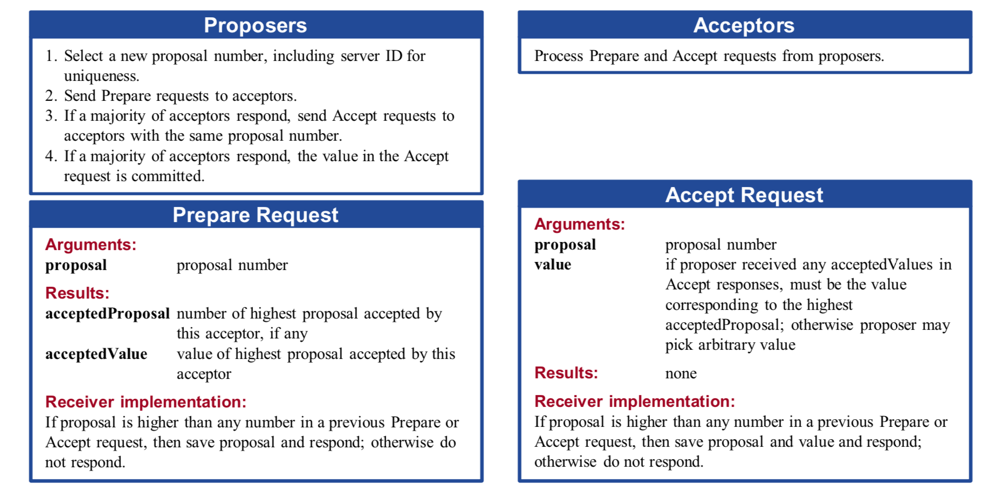
图 2.4：单决策 Paxos 共识协议摘要。详细说明请参见后文。

我们假设 Paxos 的不透明性来自它选择单决策问题作为它的基础。单决策 Paxos 是晦涩微妙的，它被划分成了两种没有简单直观解释和无法独立理解的情景。因此，这导致了很难建立起直观的感受为什么单决策 Paxos 算法能够工作。构成多决策 Paxos 增加了很多错综复杂的规则。我们相信，在多决策上达成一致性的问题（一份日志而不是单一的日志记录）能够被分解成其他的方式并且更加直接和明显。

Paxos算法的第二个问题就是它没有提供一个足够好的用来构建一个现实系统的基础。一个原因是还没有一种被广泛认同的多决策问题的算法。Lamport 的描述基本上都是关于单决策 Paxos 的；他简要描述了实施多决策 Paxos 的方法，但是缺乏很多细节。当然也有很多具体化 Paxos 的尝试，但是他们都互相不一样，和 Paxos 的概述也不同。例如 Chubby 这样的系统实现了一个类似于 Paxos 的算法，但是大多数的细节并没有被公开。

而且，Paxos 算法的结构也不是十分易于构建实践的系统；单决策分解也会产生其他的结果。例如，独立的选择一组日志条目然后合并成一个序列化的日志并没有带来太多的好处，仅仅增加了不少复杂性。围绕着日志来设计一个系统是更加简单高效的；新日志条目以严格限制的顺序增添到日志中去。另一个问题是，Paxos 使用了一种对等的点对点的方式作为它的核心（尽管它最终提议了一种弱领导人的方法来优化性能）。在只有一个决策会被制定的简化世界中是很有意义的，但是很少有现实的系统使用这种方式。如果有一系列的决策需要被制定，首先选择一个领导人，然后让他去协调所有的决议，会更加简单快速。（第 11 章讨论了 Egalitarian Paxos，这是 Paxos 的最新变体，它不使用领导者，但在某些情况下可能比使用领导者的算法更有效；但是，此算法比基于领导者的算法要复杂得多。）

因此，实际的系统中很少有和 Paxos 相似的实践。每一种实现都是从 Paxos 开始研究，然后发现很多实现上的难题，再然后开发了一种和 Paxos 明显不一样的结构。这样是非常费时和容易出错的，并且理解 Paxos 的难度使得这个问题更加糟糕。Paxos 算法在理论上被证明是正确可行的，但是现实的系统和 Paxos 差别是如此的大，以至于这些证明没有什么太大的价值。下面来自 Chubby 实现非常典型：

>在 Paxos 算法描述和实现现实系统中间有着巨大的鸿沟。最终的系统建立在一种没有经过证明的算法之上。

由于以上问题，我们认为 Paxos 算法既没有提供一个良好的基础给实践的系统，也没有给教学很好的帮助。基于一致性问题在大规模软件系统中的重要性，我们决定看看我们是否可以设计一个拥有更好特性的替代 Paxos 的一致性算法。Raft算法就是这次实验的结果。

## 4 集群成员变更

到目前为止，我们一直假设集群配置（参与共识算法的服务器集合）是固定的。实际上，在生产环境中偶尔需要变更配置，例如在服务器出现故障替换服务器时或者变更副本数时。这时可以使用以下两种方法手动完成：

* 可以通过使整个集群下线，更新配置文件，然后重启集群来变更配置。但是这将导致整个集群在配置变更期间不可用。
* 或者，新的服务器可以通过获取某个集群成员的网络地址来替换它。
然而，管理员必须保证被替换的服务器永远不会恢复，否则系统将失去其安全属性（例如，将有一个额外的投票）。

这两种成员变更的方法都有显著的缺点，而且如果有任何手动步骤都会有操作错误的风险。

为了避免这些问题，我们决定将配置变更自动化，并将它们合并 Raft 共识算法中。Raft 允许集群在配置变更期间继续正常运行，并且只需对基本共识算法进行少量扩展即可实现成员变更。图 4.1 总结了用于集群成员变更的 RPC，本章其余部分将描述其元素。

> 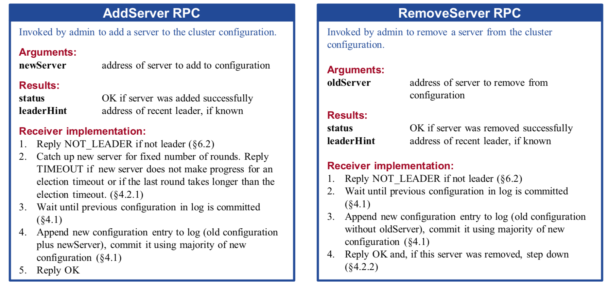
图 4.1：用于变更集群成员的 RPC。AddServer RPC 用于向当前配置添加新服务器，RemoveServer RPC 用于从当前配置中删除服务器。诸如 4.1 之类的节号指出了讨论特殊功能的地方。第 4.4 节讨论了在完整系统中使用这些 RPC 的方法。

### 4.1 安全

保障安全是配置变更的首要挑战。为了确保该机制的安全，在过渡期间不能出现两位领导者同时当选的情况。如果单个配置变更添加或删除了许多服务器，则将集群从旧配置直接切换到新配置可能是不安全的；一次自动切换所有服务器是不可能的，因此集群可能在转换期间分裂成两个独立的主体（见图 4.2）。

> 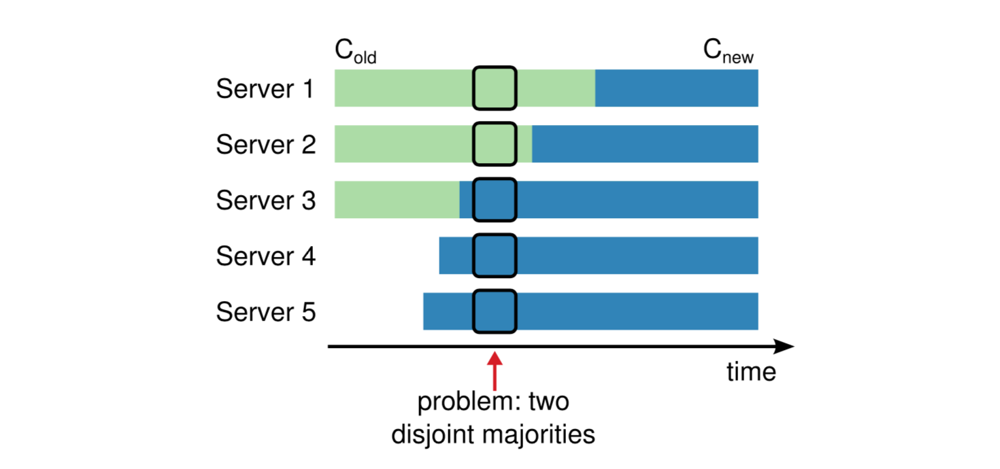
图 4.2：直接从一个配置切换到另一个配置是不安全的，因为不同的服务器将在不同的时间进行切换。在本例中，集群从 3 个服务器增长到 5 个服务器。不幸的是，在某个时间点，两个不同的领导者可以在同一个任期内被选举出来，一个拥有旧配置（Cold）的多数，另一个拥有新配置（Cnew）的多数。

大多数成员变更算法都引入了其他机制来处理这种问题。这是我们最初为 Raft 所做的，但后来我们发现了一个更简单的方法，即禁止会导致多数成员不相交的成员变更。因此，Raft 限制了允许的变更类型：一次只能从集群中添加或删除一个服务器。成员变更中更复杂的变更是通过一系列单服务器变更实现的。本章的大部分内容描述了单服务器方法，它比我们原来的方法更容易理解。为了完整起见，第 4.3 节描述了原始的方法，它增加了处理任意配置变更的复杂性。在发现更简单的单服务器变更方法之前，我们在 LogCabin 中实现了更复杂的方法；在撰写本文时，它仍然使用更复杂的方法。

当向集群中添加或删除单个服务器单个服务器时，旧集群的任何多数与新集群的任何多数重叠，参见图 4.3。这种重叠阻止了集群分裂成两个独立的多数派；在第 3.6.3 节的安全论证中，它保证了“投票人”的存在。因此，当只添加或删除一个服务器时，可以安全地直接切换到新配置。Raft 利用此属性，几乎不使用其他机制即可安全地变更集群成员。

> 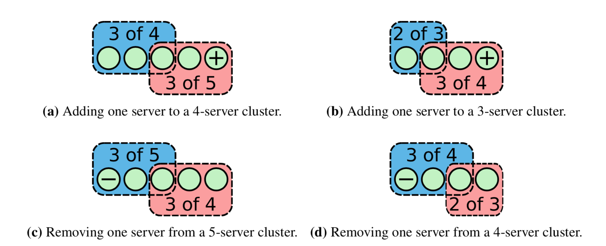
图 4.3：从偶数和奇数大小的集群中添加和删除单个服务器。在每个图中，蓝色矩形显示旧集群的大部分，红色矩形显示新集群的大部分。在每个单服务器成员变更中，旧集群的任何多数与新集群的任何多数之间都会有重叠，这用来保证安全性。例如在（b）中，旧集群的大部分必须包括其余 3 个服务器中的 2 个，而新集群的大部分必须包括新集群中的 3 个服务器，其中至少有 2 个来自旧集群。

集群配置使用复制日志中的特殊条目进行存储和通信。这利用了 Raft 的现有机制来复制和持久化配置信息。通过对配置变更和客户机请求进行排序（允许两者在管道或批处理被同时复制），它还允许集群在进行配置变更时继续为客户机请求提供服务。

当领导者收到从当前配置（Cold）中添加或删除服务器的请求时，它将新配置（Cnew）作为一个条目添加到其日志中，并使用常规的 Raft 机制复制该条目。新配置一旦添加到服务器的日志中，就会在这个服务器上生效：Cnew 条目被复制到 Cnew 指定的服务器上，而大部分服务器的新配置生效被用于确定 Cnew 条目的提交。这意味着服务器不会等待配置条目被提交，并且每个服务器总是使用在其日志中找到的最新配置。

一旦提交了 Cnew 条目，配置变更就完成了。此时，领导者知道大多数的 Cnew 指定的服务器已经采用了 Cnew。它还知道，没有收到 Cnew 条目的任意服务器都不能再构成集群的大多数，没有收到 Cnew 的服务器也不能再当选为领导者。Cnew 的提交让三件事得以继续:
1. 领导可以确认配置变更的成功完成。
2. 如果配置变更删除了服务器，则可以关闭该服务器。
3. 可以启动进一步的配置变更。在此之前，重叠的配置变更可能会降级为不安全的情况，如图 4.2 所示。

如上所述，服务器总是在其日志中使用最新的配置，而不管是否提交了配置条目。这使得领导者可以很容易地避免重叠的配置变更（上面的第三项），方法是直到之前的变更的条目提交之后才开始新的变更。只有当旧集群的大多数成员都在 Cnew 的规则下运行时，才可以安全地开始另一次成员变更。如果服务器只在了解到 Cnew 已提交时才采用 Cnew，那么 Raft 的领导者将很难知道何时旧集群的大部分已经采用它。它们需要跟踪哪些服务器知道配置变更条目的提交，服务器也需要将它们的提交索引保存到磁盘；Raft 其实不需要这些机制。相反，Raft 的每台服务器只要发现该条目存在于其日志中，就采用 Cnew，并且知道一旦提交了 Cnew 条目，就可以安全地允许进一步的配置变更。不幸的是，这个决定意味着配置变更的日志条目可以被删除（如果领导者发生变化）；在这种情况下，服务器必须准备好返回到其日志中的先前配置。

在 Raft 中，用于达成一致意见的是调用者的配置，包括投票和日志复制:
* 即使领导者并不在服务器的最新配置中，服务器依然接受它的 AppendEntries 请求。否则将永远不能将新服务器添加到集群中（它永远不会接受添加服务器的配置条目之前的任何日志条目）。
* 服务器还允许投票给不属于服务器当前最新配置的候选人（如果候选人有足够的最新日志和当前任期）。为了保持集群可用，可能偶尔需要进行投票表决。例如，考虑将第四个服务器添加到三个服务器的集群中。如果一个服务器出现故障，就需要新服务器的投票来形成多数票并选出一个领导者。

因此，服务器可以直接处理传入的 RPC 请求，而无需查询其当前配置。

### 4.2 可用性

集群成员变更在保持集群可用性方面引入了多个问题。第 4.2.1 节讨论了在将新服务器添加到集群之前使其追赶，以防止它拖延对新日志条目的提交。第 4.2.2 节介绍了如何从集群中删除现有的领导者。第 4.2.3 节介绍了如何防止已删除的服务器干扰新集群的领导者。最后，第 4.2.4 节以一个论点结束，说明为什么最终的成员变更算法足以在任何成员变更期间保留可用性。

#### 4.2.1 让新服务器追赶

当服务器被添加到集群中时，它通常不会存储任何日志条目。如果以这种状态将它添加到集群中，那么它的日志可能需要相当长的时间才能赶上领导者的日志，在此期间，集群更容易出现不可用的情况。例如，一个包含三个服务器的集群通常可以容忍一个故障而不损失可用性。但是，如果向同一集群添加了第四个服务器，其中有一个日志为空，并且原来的三个服务器之一出现故障，则集群将暂时无法提交新条目（参见图 4.4（a））。如果一个集群中连续不断地添加许多新服务器，就会出现另一个可用性问题，此时需要新服务器来组成集群的大部分（参见图 4.4（b））。在这两种情况下，直到新服务器的日志赶上领导者的日志之前，集群都将不可用。

> 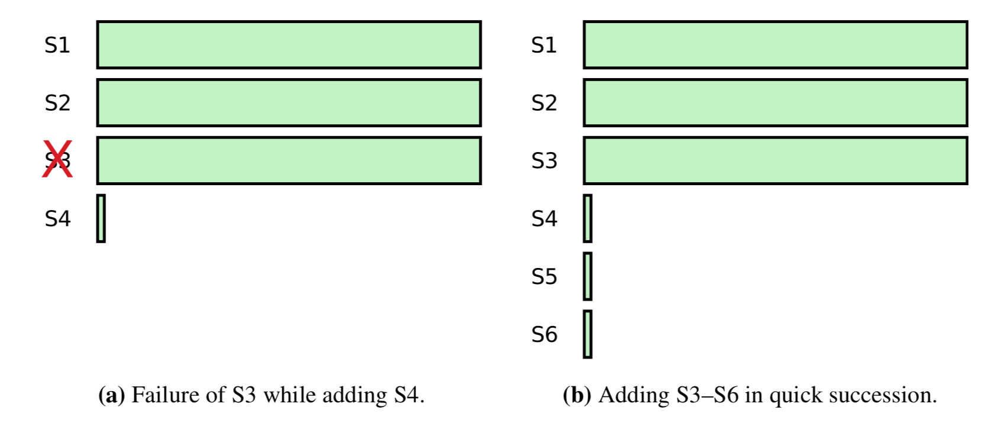
图 4.4：添加空日志的服务器如何使可用性面临风险的示例。图中显示了服务器在两个不同集群中的日志。每个集群都有三个服务器，S1-S3。在（a）中，添加了 S4，然后 S3 失败。集群应该能够在一个节点失败后正常运行，但事实上它失去了可用性：它需要四个服务器中的三个来提交一个新条目，但是 S3 失败了，S4 的日志太晚了，无法追加新条目。在（b）中，快速连续地添加了 S4–S6。提交添加 S6（第三个新服务器）的配置条目需要 4 个服务器的日志来存储该条目，但是 S4-S6 的日志远远不够。在新服务器的日志赶上之前，这两个集群都是不可用的。

为了避免可用性缺口，Raft 在配置变更之前引入了一个附加阶段，其中一个新服务器作为无投票权成员加入集群。领导者复制日志条目到它，但出于投票或提交目的，尚未计入多数。一旦新服务器赶上了集群的其余部分，就可以按照上面的描述进行重新配置。（支持无投票权服务器的机制在其他上下文中也很有用；例如，它可以用于将状态复制到大量服务器，这些服务器可以保证最终一致性提供只读请求。）

领导者需要确定什么时候一个新的服务器已经赶上进度从而可以继续进行配置变更。这需要注意保持可用性：如果服务器添加得太快，集群的可用性可能面临风险，如上所述。我们的目标是将任何暂时的不可用保持在一个选举超时以下，因为客户必须已经能够容忍这种程度的偶发性不可用（在领导者失败的情况下）。此外，如果可能的话，我们希望通过使新服务器的日志更接近领导者的日志来进一步减少不可用性。

如果新服务器不可用或速度太慢以至于永远无法赶上，则领导者还应中止变更。这项检查很重要：因为没有将这些检查包括在内，Lamport 的古老 Paxos 政府破裂了。他们不小心将成员变更为溺水的水手，无法再取得进步。尝试添加不可用或速度较慢的服务器通常是一个错误。实际上，我们的第一个配置变更请求就包含了网络端口号中的一个输入错误；系统正确地中止了变更并返回了一个错误。

我们建议使用以下算法来确定何时新服务器能够赶上并能被添加到集群中。将条目复制到新服务器的过程分为几轮，如图 4.5 所示。每一轮开始时都将当前领导者日志中的所有日志条目复制到新服务器的日志中。在为其当前轮复制条目时，新条目可能会到达领导者；它将在下一轮中复制它们。随着进程的进行，轮持续时间在时间上缩短。该算法等待固定的轮数（如 10 轮）。如果最后一轮的持续时间少于一个选举超时，则领导者将新服务器添加到集群中，并假设没有足够的未复制条目来创建显著的可用性缺口。否则，领导者将因错误中止配置变更。调用者可能总会再试一次（下一次成功的可能性更大，因为新服务器的日志已经追赶上一部分）。

> 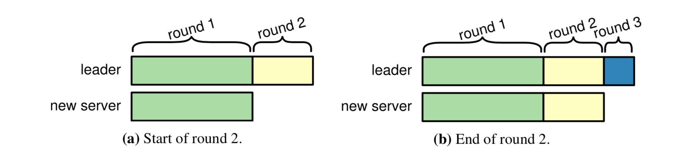
图 4.5：为了让新服务器追赶，领导者将条目复制到新服务器的过程分为几轮。每一轮结束后，新服务器就会拥有这一轮开始时领导者日志中记录的所有条目。然而，到那时，领导者可能已经收到了新的条目；这些将在下一轮中重复。

作为让新服务器追赶的第一步，领导者必须发现新服务器的日志是空的。对于新服务器，在 AppendEntries 中的一致性检查将不断失败，直到领导者的 nextIndex 最终下降到 1。这种遍历可能是影响在集群中添加新服务器的性能的主要因素（在此阶段之后，可以通过使用批处理将日志条目以更少的 RPC 传输给跟随者）。各种方法可以使 nextIndex 更快地收敛到它的正确值，包括第 3 章中描述的方法。然而，解决添加新服务器这一特殊问题的最简单方法是，使跟随者在 AppendEntries 响应中返回其日志的长度；从而使领导者可以相应地捕捉跟随者的 nextIndex。

#### 4.2.2 删除当前领导者

如果要求现有领导者将自己从集群中删除，则它必须在某个时候下台。一种简单的方法是使用第 3 章中介绍的领导权禅让扩展：被要求删除自身的领导者会将其领导权转移到另一台服务器，该服务器随后将正常执行成员变更。

我们最初为 Raft 开发了一种不同的方法，在该方法中，现有领导者进行成员变更以删除自己，然后下台。这使 Raft 处于有些尴尬的操作模式，即领导者临时管理一个它不是其成员的配置。最初，我们需要这种方法来进行任意配置变更（请参阅第 4.3 节），其中旧的配置和新的配置可能没有任何可以转移领导权的服务器，同样的方法也适用于那些没有实现领导权禅让的系统。

在这种方法中，一旦提交 Cnew 条目，从配置中删除的领导者将会下台。如果领导者在此之前下台，它可能仍会超时并再次成为领导者，从而延迟了进度。在极端情况下，从两台服务器的集群中删除领导者时，服务器甚至可能必须再次成为领导者，集群才能取得进展；参见图4.6。因此，领导者要等到 Cnew 提交再下台。这是新配置肯定可以在没有被废黜的领导者参与的情况下运行的第一点：Cnew 的成员总是有可能从他们当中选出新的领导者。被删除的领导者卸任后，Cnew 中的服务器将超时并赢得选举。这种较小的可用性缺口一般是可以容忍的，因为在领导者失败时也会出现类似的可用性缺口。

> 
图 4.6：在提交 Cnew 条目之前，已删除的服务器可能需要引导集群取得进展。 该图显示了从两个服务器集群中删除 S1。 S1 目前是负责人，S1 还不应该下台；它仍然需要作为领导者。 在 S2 收到 S1 的 Cnew 条目之前，它无法成为领导者（因为 S2 仍然需要 S1 的投票才能构成 Cold 的多数票，并且 S1 不会向 S2 投票，因为 S2 的日志不是最新的）。

这种方法对决策产生了两种影响，这些影响不是特别有害，但可能令人惊讶。首先，领导者可以在一段时间内（提交 Cnew 时）管理一个不包含自身的集群。它复制日志条目，但不占多数。其次，不属于其自身最新配置的服务器仍应开始新的选举，因为在提交 Cnew 条目之前可能仍需要它（如图 4.6 所示）。除非它是其最新配置的一部分，否则它不会在选举中计入自己的选票。

#### 4.2.3 破坏性服务器

如果没有其他机制，不在 Cnew 中的服务器可能会破坏集群。一旦集群领导者创建了 Cnew 条目，不在 Cnew 中的服务器将不再接收心跳信号，因此它将超时并开始新的选举。此外，它不会收到 Cnew 条目，也不会了解该条目已经提交，因此它不会知道它已从集群中删除。服务器将使用新的任期编号发送 RequestVote RPC，这将导致当前的领导者恢复为跟随者状态。虽然终将选举出 Cnew 的一位新领导者，但破坏性服务器将再次超时，并且该过程将重复进行，从而导致可用性降低。如果从集群中删除了多个服务器，情况还可能进一步恶化。

我们消除干扰的第一个想法是，如果一个服务器要开始选举，它首先要检查它是否浪费了每个人的时间——它有机会赢得选举。这为选举引入了一个新阶段，称为预投票阶段。候选人首先会询问其他服务器其日志是否足够新以获得他们的投票。只有当候选人相信自己能从集群中的大多数人那里获得选票时，他才会增长任期编号并开始正常的选举。

不幸的是，预投票阶段并没有解决干扰服务器的问题：在某些情况下，干扰服务器的日志已经足够新，但是开始选举仍然会造成干扰。可能令人惊讶的是，这些可能在配置变更完成之前就发生了。例如，图 4.7 显示了从集群中删除的服务器。一旦领导者创建了 Cnew 日志条目，被删除的服务器可能会造成混乱。在这种情况下，预投票检查没有帮助，因为被删除的服务器的日志比大多数集群的日志更新。（虽然预投票阶段并没有解决破坏性服务器的问题，但总体上来说，它确实是提高领导者选举稳健性的一个有用的想法；参见第 9 章）。

> 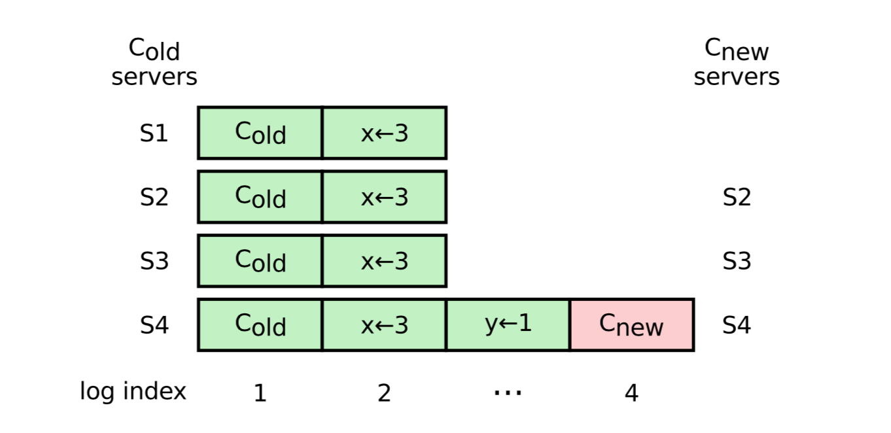
图 4.7：一个服务器如何在提交 Cnew 日志条目之前造成破坏，并且预投票阶段没有帮助的示例。图中显示了从一个包含四个服务器的集群中删除 S1 的过程。S4 是新集群的领导者，它在日志中创建了 Cnew 条目，但还没有复制该条目。旧集群中的服务器不再接收来自 S4 的心跳。甚至在提交 Cnew 之前，S1 就可以超时，增加它的任期，并将这个较大的任期号发送给新的集群，迫使 S4 下台。预投票算法没有帮助，因为 S1 的日志与大多数集群中的服务器一样是最新的。

基于这种情况，我们现在认为，仅仅基于比较日志（如预投票检查）的解决方案不足以判断选举是否具有破坏性。我们不能要求服务器在开始选举之前检查 Cnew 中每个服务器的日志，因为 Raft 必须始终能够容忍错误。我们也不希望假设领导者能够足够快地可靠地复制条目，从而快速地通过图 4.7 所示的场景；这在实践中可能是可行的，但这取决于更强的假设，即我们更希望避免探索日志分歧的性能和复制日志条目的性能。

Raft 的解决方案是使用心跳来确定何时存在有效的领导者。在 Raft 中，如果领导者能够保持跟随者的心跳状态，则它被认为是活跃的（否则，另一个服务器将开始选举）。因此，服务器不应该能够干扰正在发送心跳的领导者。我们对 RequestVote RPC 进行了修改，以实现此目的：如果服务器在从当前领导者那里听到的最小选举超时内收到 RequestVote 请求，它不会更新其任期或授予其投票。它可以放弃请求，拒绝投票或延迟请求。结果基本相同。这不会影响正常的选举，在正常的选举中，每个服务器在开始选举之前至少要等待最小选举超时的时间。但是，它有助于避免 Cnew 以外的服务器造成的干扰：尽管领导者能够对其集群发出心跳，但不会因更大任期的节点而被废黜。

此变更与第 3 章中所述的领导权禅让机制相冲突，在第 3 章中，服务器合法地开始选举而无需等待选举超时。在这种情况下，即使其他服务器认为当前的集群领导者存在，也应该处理 RequestVote 消息。这些 RequestVote 请求可以包含一个特殊标志来指示此行为（“我有权破坏领导者，是它告诉我的！”）。

#### 4.2.4 可用性参数

本节认为，上述解决方案足以在成员变更期间保持可用性。由于 Raft 的成员变更是基于领导者的，因此我们证明了该算法将能够在成员变更期间维护和替换领导者，而且领导者将同时为客户请求提供服务并完成配置变更。我们假设大多数旧配置是可用的（至少在提交 Cnew 之前），并且大部分新配置可用。

1. 可以在配置变更的所有步骤中选举一位领导者。
    * 如果新集群中具有最新日志的可用服务器具有 Cnew 条目，它可以从大多数 Cnew 那里收集选票并成为领导者。
    * 否则，Cnew 条目必然尚未提交。 在旧集群和新集群中，具有最新日志的可用服务器可以收集大多数  Cold 和大多数 Cnew 的投票，因此，无论使用哪种配置，它都可以成为领导者。

2. 领导一经选举便得到维持，假设他的心跳达到了正常状态，
除非它因不在 Cnew 中但已提交 Cnew 而有意退出。
    * 如果领导者可以可靠地将心跳发送到其自己的跟随者，则它或其跟随者都不会接受更高的任期：他们不会超时开始任何新的选举，并且他们将忽略来自其他服务器的更高任期的任何 RequestVote 消息。因此，领导者不会被迫下台。
    * 如果不在 Cnew 中的服务器提交 Cnew 条目并退出，则 Raft 将选出新的领导者。这个新领导者很可能将成为 Cnew 的一部分，从而完成配置变更。 但是，下台的服务器可能会再次成为领导者，这存在一些（较小）风险。 如果它再次当选，它将确认 Cnew 条目的提交并很快下台，并且 Cnew 中的服务器下次可能再次成功。

3. 在整个配置变更期间，领导者将为客户端请求提供服务。
    * 领导者可以在整个变更过程中继续将客户请求添加到他们的日志中。
    * 由于在将新服务器添加到集群之前对其进行了跟踪，因此领导者可以提前提交其提交索引并及时回复客户端。

4. 领导者将通过提交 Cnew 来推进并完成配置变更，并在必要时退出以允许 Cnew 中的服务器成为领导者。

因此，在上述假设下，本节中描述的机制足以在任何成员变更期间保持可用性。

### 4.3 使用联合共识进行任意配置变更

本节介绍了一种更复杂的集群成员变更方法，该方法可以处理对配置的任意变更。例如，可以一次将两个服务器添加到集群中，也可以一次替换五个服务器集群中所有的服务器。这是我们提出的第一种处理成员变更的方法，这里只是为了完整性而进行描述它。既然我们知道了更简单的单服务器方法，我们建议改为使用单服务器方法，因为处理任意变更需要额外的复杂性。任意变更通常是文献中假定的成员变更方式，但是我们认为在实际系统中并不需要这种灵活性，在实际系统中，一系列单服务器变更可以将集群成员变更为任何所需的配置。

为了确保跨任意配置变更的安全性，集群首先切换到过渡配置，我们称之为联合共识；一旦联合共识被提交，系统便过渡到新配置。联合共识将新旧配置结合到了一起：

* 日志条目被复制到所有包含新配置或旧配置的服务器。
* 来自任一配置的任何服务器都可以作为领导者。
* 协议（用于选举和条目提交）要求新老配置各占多数。 例如，当从 3 个服务器的集群变更为 9 个服务器的不同集群时，协议要求既需要旧配置的 3 个服务器中的 2 个，也需要新配置的 9 个服务器中的 5 个。

联合共识允许各个服务器在不同的时间在不同的配置之间转换，且不会影响安全性。 此外，联合共识允许集群在整个配置变更期间继续为客户请求提供服务。

这种方法通过联合配置的中间日志条目扩展了单服务器成员变更算法。图 4.8 说明了该过程。当领导者收到将配置从 Cold 变更为 Cnew 的请求时，它保存用于联合共识的配置（图中的 Cold,new）作为日志条目，并使用常规的 Raft 机制复制该条目。与单服务器配置变更算法一样，每台服务器将配置存储在日志中后即开始使用新配置。这意味着领导者将使用 Cold,new 规则来确定何时提交 Cold,new 的日志条目。如果领导者崩溃，则可以根据获胜的候选人是否收到了 Cold,new，在 Cold 或 Cold,new 下选择新的领导者。无论如何，Cnew 不能在此期间做出单方面决定。

一旦提交了 Cold,new，Cold,new 都无法在未经对方批准的情况下做出决策，并且领导者完整性属性确保只有具有 Cold,new 日志条目的服务器才能被选为领导者。现在，领导者可以安全地创建 Cnew 日志条目并将其复制到集群。一旦服务器看到该配置，它将立即生效。当在 Cnew 规则下提交了 Cnew 日志条目时，旧的配置就变为不相关，不在新配置中的服务器此时可以关闭。如图 4.8 所示，Cold 和 Cnew 都没有时间可以单方面做出决定。这样可以保证安全。

> 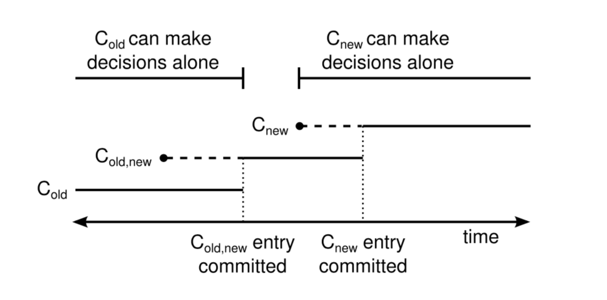
图4.8：使用联合共识进行配置变更的时间表。 虚线表示已创建但尚未提交的配置条目，实线表示最新提交的配置条目。领导者首先在其日志中创建 Cold,new 配置条目，并将其提交给 Cold,new（大多数 Cold 和 Cnew）。 然后，它创建 Cnew 条目并将其提交给大多数 Cnew。 在任何时候，Cold 和 Cnew 都不能同时独立地做出决策。

联合共识方法可以推广到允许在先前的变更仍在进行时开始新的配置变更。然而，这样做没有太大的实际好处。相反，当配置变更已在进行时（当其最新配置未提交或不是简单多数时），领导者将拒绝其他配置变更。以这种方式拒绝的变更可以简单地等待并稍后再试。

这种联合共识方法比单服务器变更更为复杂，因为它需要在中间配置之间进行转换。联合配置还要求变更所有投票和提交决定的方式；领导者必须检查服务器是否既构成旧集群的大部分，也构成新集群的大多数，而不是简单地对服务器进行计数。要实现这一点，需要发现并变更我们的 Raft 实现中的六个比较。

### 4.4 系统集成

Raft 的实现可以通过不同的方式实现本章描述的集群成员变更机制。例如，图 4.1 中的 AddServer 和 RemoveServer RPC 可以由管理员直接调用，也可以由使用一系列单服务器步骤以任意方式变更配置的脚本调用。

在响应服务器故障等事件时自动调用成员变更可能是可取的。然而，这最好根据一个合理的政策来做。例如，对于集群来说，自动删除失败的服务器可能是危险的，因为它可能会留下太少的副本来满足预期的持久性和容错需求。一种可行的方法是让系统管理员配置所需的集群大小，在此约束下，可用的服务器可以自动替换失败的服务器。

当进行需要多个单服务器步骤的集群成员变更时，最好能够在删除服务器之前添加服务器。例如，要替换三个服务器集群中的一个服务器，添加一个服务器，然后删除另一个服务器，则系统在整个过程中始终允许处理一个服务器故障。但是，如果在添加另一个服务器之前先删除一个服务器，那么系统将暂时无法容忍任何故障（因为两个服务器集群需要两个服务器都可用）。

成员变更激发了引导集群的另一种方法。如果没有动态成员变更，每个服务器只有一个列出配置的静态文件。有了动态成员变更，服务器不再需要静态配置文件，因为系统在 Raft 日志中管理配置；当然它也可能容易出错（例如，应使用哪种配置来初始化新服务器？）。实际上，我们建议在第一次创建集群时，使用配置条目作为其日志中的第一个条目来初始化一个服务器。此配置仅列出该服务器。它本身构成其配置的大部分，因此它可以认为此配置已提交。从那时起，其他服务器应使用空日志进行初始化；它们被添加到集群中，并通过成员变更机制了解当前配置。

成员变更也需要一种动态的方法让客户找到集群。这将在第 6 章中讨论。

### 4.5 结论

本章介绍了 Raft 用于自动处理集群成员变更的扩展。这是基于共识的完整系统的重要组成部分，因为容错要求可能会随时间的推移而变化，并且最终需要更换故障服务器。

由于新配置会影响“多数”的含义，因此共识算法必须从根本上保证在配置变更期间的安全性。本章介绍了一种简单的方法，可以一次添加或删除单个服务器。这些操作简单地保障了安全性，因为在变更期间至少有一台服务器与大多数服务器重叠。可以组合多个单服务器变更来更彻底地修改集群。Raft 允许集群在成员变更期间继续正常运行。

要在配置变更期间保持可用性，需要处理几个重要的问题。特别是，不属于新配置的服务器干扰有效集群领导者的问题非常微妙；在选择基于心跳的有效解决方案之前，我们在几个基于日志比较的低效解决方案中挣扎。

## 5 日志压缩

随着越来越多的客户请求，Raft 的日志在正常运行期间会不断增长。随着它变的越来越大，它会占用更多的空间，同时也需要更多的时间来回放。如果没有压缩日志的方法，最终将导致可用性问题：即服务器存储空间不足，或者启动时间太长。因此，任何实际系统都需要某种形式的日志压缩。

日志压缩的一般思想是，日志中的许多信息会随着时间的流逝而过时并可以丢弃。例如，如果稍后的操作将 x 设置为 3，则将 x 设置为 2 的操作已过时。一旦提交了日志条目并将其应用于状态机，就不再需要用于到达当前状态的中间状态和操作，并且可以压缩它们。

与 Raft 核心算法和成员变更不同，不同的系统在日志压缩方面有不同的需求。由于多种原因，没有一种适合所有人的解决方案来进行日志压缩。首先，不同的系统可能会选择在不同程度上权衡简单性和性能。其次，状态机必须紧密地参与日志压缩，并且状态机的大小以及状态机是基于磁盘还是易失性存储器的差异都很大。

本章的目的是讨论各种日志压缩方法。在每种方法中，日志压缩的大部分责任都落在状态机上，状态机负责将状态写入磁盘并压缩状态。状态机可以通过不同的方式来实现这一目标，本章将对此进行介绍，并在图 5.1 中进行总结：

>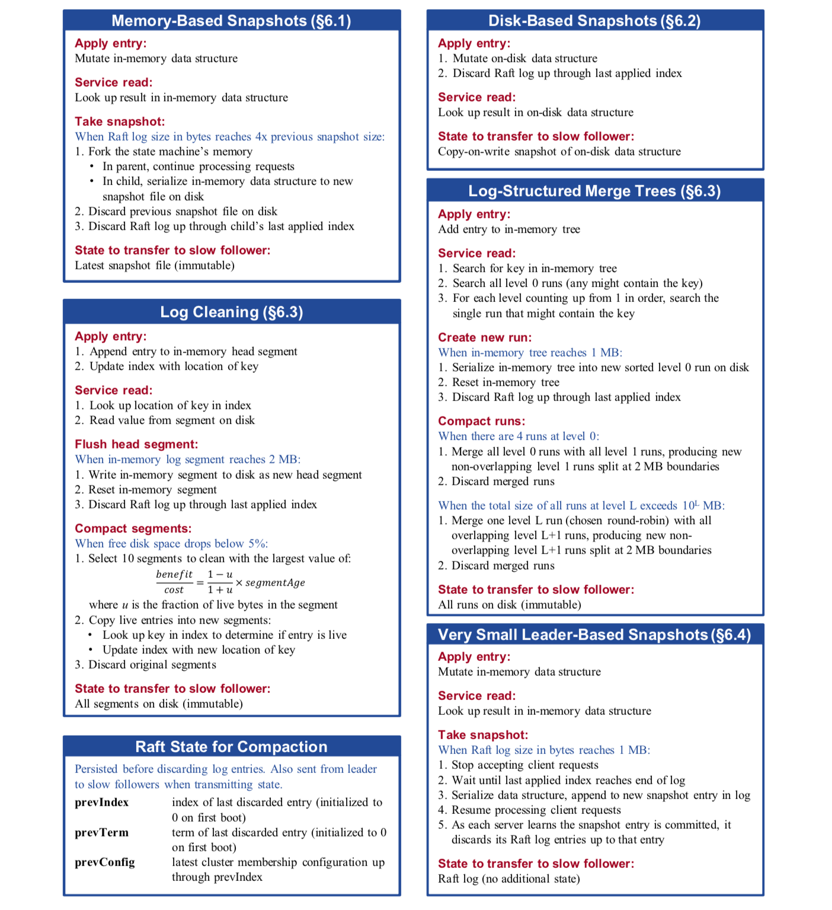
图 5.1：该图显示了如何在Raft中使用各种日志压缩方法。图中日志结构合并树的详细信息基于 LevelDB，日志清理的详细信息基于 RAMCloud。 省略了删除管理规则。

* 从概念上讲，为基于内存的状态机创建快照最为简单。在创建快照时，整个当前系统状态被写入稳定存储上的快照，然后丢弃该点之前的所有日志。这种方法在 Chubby 和 ZooKeeper 中使用，并且我们在 LogCabin 中也实现了它。它是本章第 5.1 节中最深入介绍的方法。
* 对于基于磁盘的状态机，作为正常操作的一部分，系统状态的最新副本将保留在磁盘上。因此，一旦状态机反映了对磁盘的写入，就可以丢弃 Raft 日志，并且仅在将一致的磁盘映像发送到其他服务器时才使用快照（第 5.2 节）。
* 第 5.3 节介绍了增量式日志压缩方法，例如日志清理和日志结构合并树。这些方法有效地将数据写入磁盘，并且随着时间的推移它们平均地利用资源。
* 最后，第 5.4 节讨论了通过将快照直接存储在日志中来最小化所需机制的快照方法。尽管该方法更容易实现，但仅适用于非常小的状态机。

LogCabin 当前仅实现基于内存的快照方法（它嵌入了基于内存的状态机）。

各种压缩方法都共享了几个核心概念。首先，不要将压缩决策集中在领导者上，而是每个服务器独立地压缩其日志的提交前缀。这避免了领导者向已经在日志中记录了数据的跟随者发送数据。它还有助于模块化：日志压缩的大部分复杂性都包含在状态机中，并且与 Raft 本身没有太多交互。这有助于将整个系统的复杂性降至最低：Raft 的复杂性递增而不是倍增了日志压缩的复杂性。在第 5.4 节中进一步讨论了将压缩责任集中在领导者上的其他方法（对于非常小的状态机，基于领导者的方法可能更好）。

其次，状态机和 Raft 之间的基本交互涉及到将一个日志前缀的责任从 Raft 转移到状态机。在应用条目之后，状态机将这些条目以一种可以恢复当前系统状态的方式反映到磁盘上。完成后，它告诉 Raft 放弃相应的日志前缀前的所有日志。在 Raft 放弃对日志前缀前所有日志的责任之前，它必须保存一些描述日志前缀的自身状态。具体来说，Raft 保留了它丢弃的最后一个条目的索引和任期；这会将其余的日志锚定在状态机的状态之后，并允许 AppendEntries 一致性检查继续进行（它需要日志中第一个条目之前条目的索引和任期）。为了支持集群成员的更改，Raft 还保留了丢弃日志前缀前的最新配置。

第三，一旦 Raft 丢弃了日志前缀前的日志，状态机将承担两项新的责任。如果服务器重新启动，则状态机需要先从磁盘加载与被丢弃的日志条目应用相对应的状态，然后才能应用 Raft 日志中的任何条目。此外，状态机可能需要拍摄一个一致的状态映像，以便可以将其发送给缓慢的跟随者（跟随者的日志远远落后于领导者的日志）。将压缩延迟到日志条目“完全复制”到集群中的每个成员之前是不可行的，因为必须保证少数缓慢的跟随者不阻止集群完全可用，并且随时可以将新服务器添加到集群中。因此，缓慢的跟随者或新服务器偶尔需要通过网络接收其初始状态。当 AppendEntries 中所需的下一个条目已在领导者的当前日志中删除时，Raft 会检测到。在这种情况下，状态机必须提供一个一致的状态映像，然后由领导者发送给跟随者。

### 5.1 基于内存的状态机快照

第一种快照方法适用于状态机的数据结构保存在内存中的情况。对于数据集为 GB 或数十 GB 的状态机，这是一个合理的选择。它使操作能够快速完成，因为它们不必从磁盘中获取数据。它也很容易编程实现，因为可以使用丰富的数据结构，并且每个操作都可以运行完成（不阻塞 I/O）。

图 5.2 显示了当状态机保持在内存中时，在 Raft 中进行快照的基本思想。每个服务器都独立拍摄快照，仅覆盖其日志中的已提交条目。快照中的大部分工作涉及序列化状态机的当前状态，这特定于特定的状态机实现。例如，LogCabin 的状态机使用树作为其主要数据结构；它使用顺序的深度优先遍历序列化此树（以便在应用快照时，在其子节点之前创建父节点）。状态机还必须序列化其保留的信息，来为客户端提供线性化能力（请参阅第 6 章）。

>
图 5.2：服务器用一个新的快照替换日志中提交的条目（索引 1 到 5），该快照只存储当前状态（本例中是变量 x 和 y）。在丢弃条目 1 到 5 之前，Raft 保存快照最后包含的索引（5）和任期（3），以便将快照放置到条目 6 之前的日志中。

一旦状态机完成了快照的写入，就可以将日志截断。Raft 首先存储重新启动所需的状态：快照中包含的最后一个条目的索引和任期以及该索引之前的最新配置。然后，它将丢弃日志索引在该索引前的日志。由于以前的快照不再有用，因此也可以将其丢弃。

如上所述，领导者有时可能需要将其状态发送给缓慢的跟随者和正在加入集群的新服务器。在快照中，此状态只是最新的快照，领导者使用名为 InstallSnapshot 的新 RPC 进行传输，如图 5.3 所示。当跟随者使用此 RPC 接收快照时，它必须决定如何处理其现有的日志条目。通常，快照将包含跟随者日志中尚未包含的新信息。在这种情况下，跟随者将丢弃其整个日志；它全部被快照取代，并且可能具有与快照冲突的未提交条目。相反，如果跟随者接收到描述其某个日志前缀的快照（由于重新传输或错误操作），则快照所覆盖的日志条目将被删除，但快照之后的条目仍然有效，必须保留。

>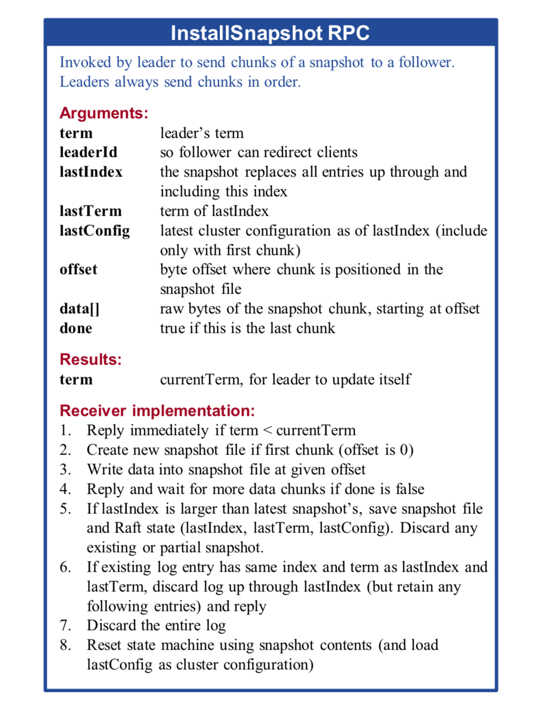
图 5.3：领导者调用 InstallSnapshot RPC 将快照发送给缓慢的跟随者。当 AppendEntries 中所需的下一个条目已在领导者的当前日志中删除时，他才会发送快照。他将快照分成多个块进行传输。除其他好处外，这还给跟随者一种领导者还活跃的迹象，因此可以重置其选举计时器。每个块均按顺序发送，从而简化了将文件写入磁盘的过程。RPC 包括 Raft 在重新启动时加载快照所需的状态：快照所覆盖的最后一个条目的索引和任期，以及此时的最新配置。

本节的其余部分讨论了基于内存的状态机快照的次要问题：
* 第 5.1.1 节讨论了如何在正常操作的同时拍摄快照，以最大程度地减少拍摄快照对客户端的影响。
* 第 5.1.2 节讨论何时应该拍摄快照，从而平衡空间的使用和拍摄快照的开销。
* 第 5.1.3 节讨论实现快照时出现的问题。

#### 5.1.1 并发拍摄快照

创建快照可能需要很长时间，无论是序列化状态还是将其写入磁盘。例如，在当今的服务器上复制 10GB 内存大约需要 1 秒钟的时间，而对其进行序列化通常将花费更长的时间：即使是固态磁盘也只能在 1 秒钟内写入约 500MB，因此，序列化和写入快照必须与正常操作同时进行，以避免出现可用性缺口。

幸运的是，写时复制技术允许应用热更新，而不会影响正在写入的快照。有两种解决方法：
* 状态机可以用不可变的（功能性）数据结构来支持这一点。因为状态机命令不会修改适当的状态，所以快照任务可以保留对某个先前状态的引用，并将其一起写入快照中。
* 或者，可以使用操作系统的写时复制支持（在编程环境允许的情况下）。例如，在 Linux 上，内存状态机可以使用 fork 来复制服务器整个地址空间。然后，子进程可以写出状态机的状态并退出，而父进程则继续为请求提供服务。LogCabin 的实现当前使用了此方法。

服务器需要额外的内存来并创建快照，应该提前计划和管理这些内存。对于状态机来说，有一个快照文件的流接口是非常重要的，这样快照在拍摄时就不必完全暂存在内存中。尽管如此，写时复制需要的额外内存与快照过程中一直在改变的状态机成比例。此外，由于错误共享，依靠操作系统进行写时复制通常会使用更多的内存（例如，如果两个不相关的数据项恰好位于同一页内存中，即使只有第一项发生了更改，第二项也会重复）。两个不相关的数据项恰好位于内存的同一页上，即使只有第一项发生了更改，第二项也会重复）。在拍摄快照期间内存容量耗尽的不幸事件中，服务器应停止接受新的日志条目，直到完成快照为止。这将暂时牺牲服务器的可用性（集群可能仍保持可用状态），但至少允许服务器恢复。最好不要中止快照并稍后重试，因为下一次尝试也可能会遇到相同的问题。（LogCabin 实现了流接口，但目前还不能优雅地处理内存耗尽问题。）

#### 5.1.2 何时拍摄快照

服务器必须决定何时进行快照。如果服务器快照太频繁，则会浪费磁盘带宽和其他资源；如果快照太不频繁，则可能会耗尽其存储容量，并增加了重新启动期间重放日志所需的时间。

一种简单的策略是在日志达到固定大小（以字节为单位）时拍摄快照。如果将此大小设置为比快照的预期大小大得多，那么用于快照的磁盘带宽开销将很小。但是，对于小型状态机，这可能导致不必要的没有被压缩的大量日志。

更好的方法是将快照的大小与日志的大小进行比较。如果快照比日志小很多倍，则可能值得拍摄快照。但是，在拍摄快照之前计算快照的大小可能既困难又麻烦，给状态机带来了很大的负担，也许需要与实际拍摄快照几乎相同的工作来动态地计算快照的大小。压缩快照文件可以节省空间和带宽，但是很难预测压缩输出的大小。

幸运的是，使用上一个快照的大小而不是下一个快照的大小可以得到合理的行为。一旦日志的大小超过前面快照的大小乘以一个可配置的扩展因子，服务器就会拍摄快照。扩展因子在磁盘带宽与空间利用率之间进行权衡。例如，扩展因子 4 导致约 20% 的磁盘的带宽用于快照（对于快照的每 1 字节，将写入 4 字节的日志条目），并且存储一个快照（旧的快照，日志 4 倍，和新写入的快照）需要大约其 6 倍的磁盘容量。

快照仍然会导致 CPU 和磁盘带宽的大量使用，这可能会影响客户机的性能。这可以通过增加硬件来缓解；例如，可以使用第二个磁盘驱动器来提供额外的磁盘带宽。

其实也可能以客户端请求永远不会在正在快照的服务器上等待的方式来调度拍摄快照。在这种方法中，服务器将进行协调，以便在任何时候（如果可能）仅对集群中的少数服务器拍摄快照。由于 Raft 只需要大多数服务器来提交日志条目，因此少数拍摄快照的服务器通常不会对客户端产生不利影响。当领导者希望拍摄快照时，它将首先退出，从而允许另一台服务器来管理集群。如果此方法足够可靠，则还可以消除并发拍摄快照的需求；服务器拍摄快照时可能只是不可用（尽管它们将计入集群掩盖故障的能力）。这对于将来的工作来说是一个令人兴奋的机会，因为它有可能提高整体系统性能并减少机制。

#### 5.1.3 实现问题

本节回顾了拍摄快照实现所需的主要组件，并讨论了实现它们的困难：

* 保存和加载快照：保存快照涉及序列化状态机的状态并将该数据写到文件中，而加载则是相反的过程。尽管从各种类型的数据对象的原型表示中序列化它们有些繁琐，我们发现这还是相当简单。从状态机到磁盘上文件的流接口有助于避免将整个状态机状态缓冲到内存；压缩流并对其应用校验和也可能是有益的。LogCabin 首先将每个快照写入一个临时文件，然后在写入完成并刷新到磁盘后重命名该文件。这样可以确保没有服务器在启动时加载部分写入的快照。

* 传输快照：传输快照涉及实现 InstallSnapshot RPC 的领导者和跟随者。这非常简单，并且可以与从磁盘中保存和加载快照共享一些代码。传输的性能通常不是很重要（需要此快照的跟随者尚未参与条目的提交，所以可能不需要很快；另一方面，如果集群遭受其他故障，则可能需要跟随者尽快追赶上以恢复可​​用性）。

* 消除不安全的日志访问并丢弃日志条目：我们最初设计 LogCabin 时没有考虑日志压缩，因此代码假定如果日志中存在条目 i，则也将存在条目 1 至 i - 1。考虑日志压缩之后，这不再正确。例如，在确定 AppendEntries RPC 中上一个条目的任期时，该条目可能已被丢弃。在整个代码中去除这些假设需要仔细的推理和测试。如果编译器能够强制每个对日志的访问都处理索引越界的情况，那么在更强大的类型系统的帮助下，这将更容易实现。一旦我们确保所有日志访问的安全，丢弃日志前缀就很简单了。在此之前，我们只能单独测试保存、加载和传输快照，但是当日志条目可以安全地丢弃时，这些都可以在系统范围的测试中执行。

* 写时复制并发拍摄快照：并发拍摄快照可能需要重新运行状态机或利用操作系统的 fork 操作。 LogCabin 目前使用了 fork，它与线程和 C++ 析构函数的交互性很差。要使其正常工作会带来一些困难。但是，它只需要少量代码，并且完全不需要修改状态机的数据结构，因此我们认为这是正确的方法。

* 决定何时拍摄快照:我们建议在开发期间应用每个日志条目后进行快照，因为这有助于快速捕获 bug 。一旦实现完成后，就应该添加一个更有用的拍摄快照策略（例如，使用有关 Raft 日志大小和最后一个快照大小的统计信息）。

我们发现快照的分段开发和测试是一个挑战。在可以丢弃日志条目之前，这些组件中的大多数必须已经就位，但只有在此之后，才会在系统范围的测试中执行许多新的代码路径。因此，实现者应该仔细考虑实现和测试这些组件的顺序。

### 5.2 基于磁盘的状态机快照

本节讨论了使用磁盘作为其主要记录位置的大型状态机（数十或数百 GB）的快照方法。这些状态机的行为有所不同，它们总是在磁盘上准备好状态的副本，以防崩溃。应用 Raft 日志中的每个条目都会更改磁盘上的状态，并有效地获得新的快照。因此，一旦应用了条目，就可以从 Raft 日志中将其丢弃。（状态机还可以缓冲内存中的写操作，以期提高磁盘效率；一旦将它们写入磁盘，相应的条目就可以从 Raft 日志中丢弃。）

基于磁盘的状态机的主要问题是改变磁盘上的状态会导致性能下降。如果没有写缓冲，那么每个命令应用时都需要一个或多个随机磁盘写，这会限制系统的总体写吞吐量（而写缓冲可能也没有多大帮助）。第 5.3 节讨论了日志压缩的增量方法，该方法可通过大量顺序写更有效地将数据写入磁盘。

基于磁盘的状态机必须能够提供一直的磁盘快照，以便将其传输给缓慢的跟随者。尽管他们总是在磁盘上有快照，但他们也在不断对其进行修改。因此，他们仍然需要写时复制技术，以便在足够长的时间内保持一致的快照，以便传输它。幸运的是，磁盘格式几乎总是划分为逻辑块，因此在状态机中实现写时复制应该很简单。基于磁盘的状态机也可以依赖于操作系统支持来获取快照。例如，Linux 上的 LVM（逻辑卷管理）可用于创建整个磁盘分区的快照，另外一些最新的文件系统允许快照单个目录。

复制磁盘映像的快照可能会花费很长时间，并且随着对磁盘修改的积累，保留快照所需的额外磁盘使用量也会增加。尽管我们尚未实现基于磁盘的快照，但我们推测基于磁盘的状态机可以通过以下算法传输其磁盘内容来避免大部分此类开销：

1. 对于每个磁盘块，跟踪其上次修改的时间。
2. 在继续正常操作的同时，将整个磁盘内容逐块传输到跟随者。在此过程中，领导者上没有使用额外的磁盘空间。由于块是并发修改的，因此很可能导致跟随者磁盘上的磁盘映像不一致。当每个块从领导者转移时，注意它最后的修改时间。
3. 拍摄磁盘内容的写时复制快照。一旦采取了这种措施，领导者将拥有其磁盘内容的一致性副本，但是由于客户端的持续操作，对磁盘的修改会使用额外的磁盘空间。
4. 仅重新传输在步骤 2 中首次传输它们与在步骤 3 中拍摄快照之间所修改的磁盘块。

我们希望一致性快照的大多数块在步骤 3 拍摄快照前已经被传输。如果是这种情况，步骤 4 中的传输将很快进行：在步骤 4 中用于保留领导者快照的额外磁盘容量将很少，而且在步骤 4 中用于再次传输修改磁盘块的额外网络带宽也很低。

### 5.3 增量清理方法

也可以采用增量方法进行压缩，例如日志清理和日志结构合并树（LSM 树）。 尽管它们比快照更复杂，但增量方法具有一些理想的特性：

* 它们一次只处理一部分数据，因此它们会随时间平均分配压缩负载。
* 无论是非正常操作还是压缩期间，它们都可以高效地写入磁盘。在两种情况下，它们都使用了大量顺序写。增量方法还选择性地压缩了磁盘中可回收空间最大的部分，因此与基于内存的状态机快照（在每个快照上重写所有磁盘）相比，它们向磁盘写入的数据更少。
* 他们可以很轻松地传输一致的状态快照，因为它们不会修改磁盘区域。

第 5.3.1 节和第 5.3.2 节首先介绍了日志清理和 LSM 树的基本知识。然后，第 5.3.3 节讨论了如何将它们应用于 Raft。

#### 5.3.1 日志清理基础

日志清理是在日志结构文件系统的上下文中引入的，最近已提出用于内存存储系统（例如 RAMCloud）的方法。原则上，日志清理可用于任何类型的数据结构，尽管某些类型的数据结构比其他类型的数据结构更难有效地实现。

日志清理功能将日志保留为系统状态的记录位置。该布局针对顺序写进行了优化，并高效的实现了随机读。因此，需要索引结构来定位要读取的数据项。

在日志清理时，会将日志分为称为段的连续区域。日志清理器的每次都使用三步算法来压缩日志：

1. 首先选择要清除的段，这些段已累积了大量的过期条目。
2. 然后，将活动条目（那些有助于当前系统状态的活动条目）从这些段复制到日志的头部。
3. 最后，它释放了这些段的存储空间，从而使该空间可用于新段。

为了最小化对正常运行的影响，这个过程并发执行。

将活动条目复制到日志开头的结果是，条目无法按顺序进行重放。这些条目可以包含其他信息（例如版本号），以便在应用日志时重新创建正确的顺序。

选择清理哪一部分的策略对性能有很大的影响；先前的研究提出了一种成本效益策略，该策略不仅考虑了活动条目所使用的空间数量，而且还考虑了这些条目可能保持活动的时间。

确定条目是否是活动的是状态机的职责。例如，在键值存储中，如果键存在并且当前已设置为给定值，则用于将键设置为特定值的日志条目是活动的。确定删除键的日志条目是否是活动的则更加微妙：只要在日志中存在设置该键的任何先前条目，该日志条目就是活动的。RAMCloud 根据需要保留删除命令（称为逻辑删除命令），但是另一种方法是定期写出当前状态下存在的键的摘要，然后所有未列出的键的日志条目都不是活动的。键值存储是一个相当简单的例子；其他状态机是可能确定活动性的，但不幸的是，其方法各不相同。

#### 5.3.2 日志结构合并树基础

日志结构合并树（LSM 树）最初由 O'Neil 描述，后来通过 BigTable 在分布式系统中流行。 它们用在诸如 Apache Cassandra 和 HyperDex 之类的系统中，并且可以作为诸如 LevelDB 及其分支（例如 RocksDB 和 HyperLevelDB ）之类的系统使用。

LSM 树是存储有序键值对的树状数据结构。在较高的层次上看，他们使用磁盘的方式类似于日志清理方法：它们会进行大量顺序写，并且不会就地修改磁盘上的数据。 但是，LSM 树不维护日志中的所有状态，而是重新组织状态以实现更好的随机访问。

典型的 LSM 树将最近写入的键保留在磁盘上的小日志中。当日志达到固定大小时，将按键对日志进行排序，并按排序顺序将其写入称为 Run 的文件。Run 永远不会被修改，但压缩过程会定期将多个R un 合并在一起，从而产生新的 Run 并丢弃旧的 Run。合并让人想起归并排序；当一个键在多个输入 Run 中时，仅保留最新版本，因此生成的 Run 更加紧凑。图 5.1 总结了 LevelDB 中使用的压缩策略。它按年龄区分运行以提高效率（类似于日志清理）。

在正常运行期间，状态机可以直接对此数据进行操作。要读取键，它首先检查该键是否最近在其日志中被修改，然后检查每个 Run。为了避免在每次查找 Run 是否有键时实行遍历，某些系统会为每个 Run 创建一个布隆过滤器（紧凑的数据结构，在某些情况下可以肯定地说某个键在 Run 中不存在，尽管有时即使键不存在也可能需要搜索 Run）。

#### 5.3.3 Raft 中的日志清理和日志结构化合并树

我们还没有尝试在 Raft 中实现日志清理或 LSM 树，但是我们推测两者都可以工作的很好。将 LSM 树应用于 Raft 似乎相当简单。因为 Raft 日志已经将最近的条目持久化到磁盘上，所以 LSM 树可以将最近的数据以更方便的树格式保存在内存中。这对于服务查找将是快速的，并且当 Raft 日志达到固定大小时，树已经排好序，可以作为新的 Run 写入磁盘。将状态从领导者转移到缓慢的跟随者需要将所有 Run 发送到跟随者（但不包括内存树）；幸运的是，Run 是不可变的，因此不必担心在传输期间会修改 Run。

对 Raft 进行日志清理则不是很明确。我们首先考虑了一种方法，其中将 Raft 分为几段并进行清理（见图 5.4（a））。不幸的是，清理会在释放段的日志中放置很多空洞，这需要修改日志复制的方法。我们认为这种方法是可行的，但是它给 Raft 及其与状态机的交互增加了极大的复杂性。此外，由于只有领导者可以追加到 Raft 日志中，因此清理工作必须基于领导者，这将浪费领导者的网络带宽（这将在 5.4 节中进一步讨论）。

>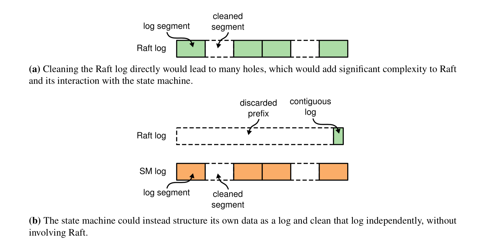
图 5.4：在 Raft 中进行日志清理的两种可能方法。

更好的方法是类似于 LSM 树来处理日志清理：Raft 将最近的更改保留为连续的日志，而状态机将其自身的状态保留为日志，但是这些日志在逻辑上是不同的（请参见图 5.4（b））。当 Raft 日志增长到固定大小时，它的新条目将被写入状态机日志中的一个新段，并且 Raft 日志的相应前缀前的日志将被丢弃。状态机中的段将在每台服务器上独立清理，并且 Raft 日志将完全不受此影响。与直接清除 Raft 日志相比，我们更喜欢这种方法，因为日志清除的复杂性完全封装在状态机中（状态机和 Raft 之间的接口仍然很简单），并且服务器可以独立进行清理。

如上所述，这种方法将要求状态机将所有 Raft 的日志条目写入其自己的日志中（尽管它可以大批量地这样做）。可以通过直接从 Raft 日志中移动包含日志条目的文件，并将该文件合并到状态机的数据结构中，从而优化掉这个额外的副本。这对于性能至关重要的系统可能是有用的优化，但是不幸的是，它将更紧密地耦合状态机模块和 Raft 模块，因为状态机将需要了解 Raft 日志的磁盘表示。

### 5.4 备选方案：基于领导者的方法

本章介绍的日志压缩方法有别于 Raft 强有力的领导者原则，因为服务器可以在领导者不知情的情况下压缩日志。但是，我们认为这种背离是合理的。尽管拥有领导者可以避免在达成共识时出现冲突的决策，但是在拍摄快照时已经达成共识，因此不会有决策冲突。数据仍然仅从领导者流向跟随者，但是跟随者现在可以独立地重组其数据。

我们还考虑了基于领导者的日志压缩方法，但是任何好处通常都被性能考虑所抵消。领导者压缩它的日志，然后将结果发送给跟随者，这是很浪费的，因为他们也可以独立地压缩自己的日志。将冗余状态发送给每个跟随者将浪费网络带宽并减慢压缩过程。每个跟随者已经掌握了压缩自身状态所需的信息，而领导者的向外网络带宽通常是 Raft 最宝贵的资源（瓶颈）。对于基于内存的快照，从服务器本地状态拍摄快照通常比通过网络发送和接收快照要节约资源得多。对于增量压缩方法，这更多地取决于硬件配置，但是我们也认为独立压缩会更节约资源。

#### 5.4.1 将快照存储在日志中

基于领导者的方法的一个可能好处是，如果所有系统状态都可以存储在日志中，那么就不需要新的机制来复制和保持状态。因此，我们考虑了一种基于领导者的快照方法，在这种方法中，领导者将创建快照并将快照存储为 Raft 日志中的条目，如图 5.5 所示。领导者随后将使用 AppendEntries RPC 将快照发送给其每个跟随者。为了减少对正常操作的任何干扰，每个快照将被分成许多条目，并与日志中的普通客户端命令交织在一起。

>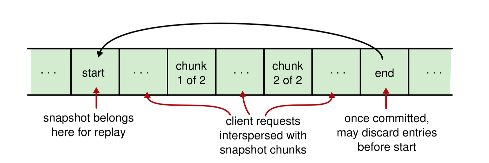
图 5.5：基于领导者的方法将快照存储在日志中的块中，与客户端请求交错。快照过程在开始条目处开始，并在结束条目处完成。快照存储在开始和结束之间的多个日志条目中。因此，客户端请求可以与快照并行进行，每个条目的大小受到限制，并且条目附加到日志的速率受到限制：只有当领导者获悉前一个快照块已经提交时，下一个快照块才会继续附加日志。每个服务器得知结束条目已提交后，就可以丢弃其日志中的条目直到对应的开始条目为止。重放日志需要一个两步算法：首先应用最后一个完整的快照，然后再应用快照开始条目之后的客户端请求。

与将快照存储在日志之外相比，这将实现更好的机制经济性，因为服务器不需要单独的机制来传输或持久化快照（它们将像其他日志条目一样被复制并持久化）。但是这些跟随者可能很容易生成自己的快照，所以这样会浪费跟随者的网络带宽，除此以外这还有一个严重的问题，如果领导者在创建快照的过程中失败，则它将部分快照保留在服务器的日志中。原则上，这种情况可能会反复发生，并且会耗尽服务器的存储容量，并会因无数次失败的快照尝试而积累起来。因此，我们认为这种机制在实践中不可行。

#### 5.4.2 对于非常小的状态机使用基于领导者的方法

对于非常小的状态机，将快照存储在日志中不仅可行，而且还可以大大简化。如果快照足够小（最多约 1M 字节），则可以轻松地将其放入单个日志条目中，而不会中断正常操作时间太长。为了以这种方式压缩服务器的日志，领导者需要：

1. 停止接受新的客户请求。
2. 等待提交其日志中的所有条目，并等待其状态机应用其日志中的所有条目。
3. （同步）拍摄快照。
4. 将快照追加到其日志末尾的单个日志条目中。
5. 恢复接受新的客户请求。

一旦每个服务器都知道快照条目已提交，它就可以丢弃其日志中快照之前的每个条目。这种方法会在客户端请求被停止和快照条目被传输时造成一个小的可用性缺口，但是它对非常小的状态机的影响是有限的。

这种更简单的方法避免了在日志之外持久化快照，使用新的 RPC 传输快照以及并发快照的实现工作。然而，成功的系统往往比它们最初设计者所期望的使用得更多，这种方法对于大型的状态机并不适用。

### 5.5 结论

本章讨论了 Raft 中日志压缩的几种方法，图 5.1 对此进行了概述。不同的方法适用于不同的系统，具体取决于状态机的大小，所需的性能水平以及预算的复杂程度。Raft 支持具有多种共享同一概念框架的方法：

* 每个服务器都独立压缩其日志的提交前缀。
* 状态机和 Raft 之间的基本交互涉及将日志前缀的责任从 Raft 转移到状态机。一旦状态机将命令应用到磁盘上，它就会指示 Raft 放弃日志的相应前缀前的日志。Raft 会保留它最后丢弃条目的索引和任期，以及该索引的最新配置。
* 一旦 Raft 丢弃了日志前缀前的日志，状态机将承担两项新的职责：在重新启动时加载状态，提供一致的映像传输给缓慢的跟随者。

基于内存的状态机快照已在包括 Chubby 和 ZooKeeper 在内的多个生产系统中成功使用，并且我们已在 LogCabin 中实现了这种方法。尽管对大多数操作而言，在内存数据结构上进行操作很快速，但快照过程中的性能可能会受到很大的影响。并发拍摄快照有助于隐藏资源使用情况，将来，在集群中调度服务器在不同时间进行快照可能会使快照过程完全不影响客户端。

在适当位置改变其状态的基于磁盘的状态机在概念上很简单。他们仍然需要写时复制技术来将一致的磁盘映像传输到其他服务器，但这对于磁盘来说可能是一个很小的负担，因为磁盘自然会分成多个块。但是，正常操作期间的磁盘随机写速度通常会很慢，因此这种方法将限制系统的写入吞吐量。

最终，增量方法可能是最有效的压缩形式。通过一次对状态的小片段进行操作，它们可以限制资源使用的突然增加（并且还可以并发压缩）。它们还可以避免将相同的数据重复写入磁盘。稳定的数据应该进入不经常压缩的磁盘区域。尽管实现增量压缩可能很复杂，但是可以将这种复杂性转移到诸如 LevelDB 之类的库中。此外，通过将数据结构保留在内存中并在内存中缓存更多磁盘，具有增量压缩功能的客户端操作的性能可以接近基于内存的状态机。
