# 寻找一种易于理解的一致性算法（扩展版）

- [寻找一种易于理解的一致性算法（扩展版）](#寻找一种易于理解的一致性算法扩展版)
  - [摘要](#摘要)
  - [1 介绍](#1-介绍)
  - [2 复制状态机](#2-复制状态机)
  - [3 Paxos 算法的问题](#3-paxos-算法的问题)
  - [4 为了可理解性的设计](#4-为了可理解性的设计)
  - [5 Raft 一致性算法](#5-raft-一致性算法)
    - [5.1 Raft 基础](#51-raft-基础)
    - [5.2 领导人选举](#52-领导人选举)
    - [5.3 日志复制](#53-日志复制)
    - [5.4 安全性](#54-安全性)
      - [5.4.1 选举限制](#541-选举限制)
      - [5.4.2 提交之前任期内的日志条目](#542-提交之前任期内的日志条目)
      - [5.4.3 安全性论证](#543-安全性论证)
    - [5.5 跟随者和候选人崩溃](#55-跟随者和候选人崩溃)
    - [5.6 时间和可用性](#56-时间和可用性)
  - [6 集群成员变化](#6-集群成员变化)
  - [7 日志压缩](#7-日志压缩)
  - [8 客户端交互](#8-客户端交互)
  - [9 算法实现和评估](#9-算法实现和评估)
    - [9.1 可理解性](#91-可理解性)
    - [9.2 正确性](#92-正确性)
    - [9.3 性能](#93-性能)
  - [10 相关工作](#10-相关工作)
  - [11 结论](#11-结论)
  - [12 感谢](#12-感谢)
  - [参考](#参考)

## 摘要

Raft 是一种为了管理复制日志的一致性算法。它提供了和 Paxos 算法相同的功能和性能，但是它的算法结构和 Paxos 不同，使得 Raft 算法更加容易理解并且更容易构建实际的系统。为了提升可理解性，Raft 将一致性算法分解成了几个关键模块，例如领导人选举、日志复制和安全性。同时它通过实施一个更强的一致性来减少需要考虑的状态的数量。一项用户研究的结果表明，对于学生而言，Raft 算法比 Paxos 算法更加容易学习。Raft 算法还包括一个新的机制来允许集群成员的动态改变，它利用重叠的大多数来保证安全性。

## 1 介绍

一致性算法允许一组机器像一个整体一样工作，即使其中一些机器出现故障也能够继续工作下去。正因为如此，一致性算法在构建可信赖的大规模软件系统中扮演着重要的角色。在过去的 10 年里，Paxos 算法统治着一致性算法这一领域：绝大多数的实现都是基于 Paxos 或者受其影响。同时 Paxos 也成为了教学领域里讲解一致性问题时的示例。

但是不幸的是，尽管有很多工作都在尝试降低它的复杂性，但是 Paxos 算法依然十分难以理解。并且，Paxos 自身的算法结构需要进行大幅的修改才能够应用到实际的系统中。因此工业界和学术界都对 Paxos 算法感到十分头疼。

努力研究过 Paxos 算法之后，我们开始寻找一种新的一致性算法，可以为构建实际的系统和教学提供更好的基础。与 Paxos 不同，我们的首要目标是可理解性：我们是否可以在实际系统中定义一个一致性算法，并且比 Paxos 算法更容易学习。此外，我们希望该算法方便系统构建者的直觉的发展。重要的不仅仅是算法能够工作，更重要的是能够很清楚地知道它为什么能工作。

Raft 一致性算法就是这些工作的结果。在设计 Raft 算法的时候，我们使用一些特别的技巧来提升它的可理解性，包括算法分解（Raft 主要被分成了领导人选举，日志复制和安全三个模块）和减少状态机的状态（相对于 Paxos，Raft 减少了非确定性和服务器互相处于非一致性的方式）。一份针对两所大学 43 个学生的研究表明 Raft 明显比 Paxos 算法更加容易理解。在这些学生同时学习了这两种算法之后，和 Paxos 比起来，其中 33 个学生能够回答有关于 Raft 的问题。

Raft 算法在许多方面和现有的一致性算法都很相似（主要是 Oki 和 Liskov 的 Viewstamped Replication），但是它也有一些独特的特性：

* **强领导人**：和其他一致性算法相比，Raft 使用一种更强的领导能力形式。比如，日志条目只从领导人发送给其他的服务器。这种方式简化了对复制日志的管理并且使得 Raft 算法更加易于理解。
* **领导选举**：Raft 算法使用一个随机计时器来选举领导人。这种方式只是在任何一致性算法都必须实现的心跳机制上增加了一点机制。在解决冲突的时候会更加简单快捷。
* **成员关系调整**：Raft 使用一种共同一致的方法来处理集群成员变换的问题，在这种方法下，处于调整过程中的两种不同的配置集群中大多数机器会有重叠，这就使得集群在成员变换的时候依然可以继续工作。

我们相信，Raft 算法不论出于教学目的还是作为实践项目的基础都是要比 Paxos 或者其他一致性算法要优异的。它比其他算法更加简单，更加容易理解；它的算法描述足以实现一个现实的系统；它有好多开源的实现并且在很多公司里使用；它的安全特性已经被正式定义和证明；它的效率和其他算法比起来也不相上下。

接下来，这篇论文会介绍以下内容：复制状态机问题（第 2 节），讨论 Paxos 的优点和缺点（第 3 节），讨论我们为了可理解性而采取的方法（第 4 节），阐述 Raft 一致性算法（第 5-8 节），评价 Raft 算法（第 9 节），以及一些相关的工作（第 10 节）。

## 2 复制状态机

一致性算法是从复制状态机的背景下提出的（参考英文原文引用37）。在这种方法中，一组服务器上的状态机产生相同状态的副本，并且在一些机器宕掉的情况下也可以继续运行。复制状态机在分布式系统中被用于解决很多容错的问题。例如，大规模的系统中通常都有一个集群领导人，像 GFS、HDFS 和 RAMCloud，典型应用就是一个独立的复制状态机去管理领导选举和存储配置信息并且在领导人宕机的情况下也要存活下来。比如 Chubby 和 ZooKeeper。

> 图 1 ：复制状态机的结构。一致性算法管理着来自客户端指令的复制日志。状态机从日志中处理相同顺序的相同指令，所以产生的结果也是相同的。

复制状态机通常都是基于复制日志实现的，如图 1。每一个服务器存储一个包含一系列指令的日志，并且按照日志的顺序进行执行。每一个日志都按照相同的顺序包含相同的指令，所以每一个服务器都执行相同的指令序列。因为每个状态机都是确定的，每一次执行操作都产生相同的状态和同样的序列。

一致性算法的任务是保证复制日志的一致性。服务器上的一致性模块接收客户端发送的指令然后添加到自己的日志中。它和其他服务器上的一致性模块进行通信来保证每一个服务器上的日志最终都以相同的顺序包含相同的请求，即使有些服务器发生故障。一旦指令被正确的复制，每一个服务器的状态机按照日志顺序处理他们，然后输出结果被返回给客户端。因此，服务器集群看起来形成了一个高可靠的状态机。

实际系统中使用的一致性算法通常含有以下特性：

* 安全性保证（绝对不会返回一个错误的结果）：在非拜占庭错误情况下，包括网络延迟、分区、丢包、重复和乱序等错误都可以保证正确。
* 可用性：集群中只要有大多数的机器可运行并且能够相互通信、和客户端通信，就可以保证可用。因此，一个典型的包含 5 个节点的集群可以容忍两个节点的失败。服务器被停止就认为是失败。它们稍后可能会从可靠存储的状态中恢复并重新加入集群。
* 不依赖时序来保证一致性：物理时钟错误或者极端的消息延迟只有在最坏情况下才会导致可用性问题。
* 通常情况下，一条指令可以尽可能快的在集群中大多数节点响应一轮远程过程调用时完成。小部分比较慢的节点不会影响系统整体的性能。

## 3 Paxos 算法的问题

在过去的 10 年里，Leslie Lamport 的 Paxos 算法几乎已经成为一致性的代名词：Paxos 是在课程教学中最经常使用的算法，同时也是大多数一致性算法实现的起点。Paxos 首先定义了一个能够达成单一决策一致的协议，比如单条的复制日志项。我们把这一子集叫做单决策 Paxos。然后通过组合多个 Paxos 协议的实例来促进一系列决策的达成。Paxos 保证安全性和活性，同时也支持集群成员关系的变更。Paxos 的正确性已经被证明，在通常情况下也很高效。

不幸的是，Paxos 有两个明显的缺点。第一个缺点是 Paxos 算法特别的难以理解。完整的解释是出了名的不透明；通过极大的努力之后，也只有少数人成功理解了这个算法。因此，有了几次用更简单的术语来解释 Paxos 的尝试。尽管这些解释都只关注了单决策的子集问题，但依然很具有挑战性。在 2012 年 NSDI 的会议中的一次调查显示，很少有人对 Paxos 算法感到满意，甚至在经验老道的研究者中也是如此。我们自己也尝试去理解 Paxos；我们一直没能理解 Paxos 直到我们读了很多对 Paxos 的简化解释并且设计了我们自己的算法之后，这一过程花了近一年时间。

我们假设 Paxos 的不透明性来自它选择单决策问题作为它的基础。单决策 Paxos 是晦涩微妙的，它被划分成了两种没有简单直观解释和无法独立理解的情景。因此，这导致了很难建立起直观的感受为什么单决策 Paxos 算法能够工作。构成多决策 Paxos 增加了很多错综复杂的规则。我们相信，在多决策上达成一致性的问题（一份日志而不是单一的日志记录）能够被分解成其他的方式并且更加直接和明显。

Paxos算法的第二个问题就是它没有提供一个足够好的用来构建一个现实系统的基础。一个原因是还没有一种被广泛认同的多决策问题的算法。Lamport 的描述基本上都是关于单决策 Paxos 的；他简要描述了实施多决策 Paxos 的方法，但是缺乏很多细节。当然也有很多具体化 Paxos 的尝试，但是他们都互相不一样，和 Paxos 的概述也不同。例如 Chubby 这样的系统实现了一个类似于 Paxos 的算法，但是大多数的细节并没有被公开。

而且，Paxos 算法的结构也不是十分易于构建实践的系统；单决策分解也会产生其他的结果。例如，独立地选择一组日志条目然后合并成一个序列化的日志并没有带来太多的好处，仅仅增加了不少复杂性。围绕着日志来设计一个系统是更加简单高效的；新日志条目以严格限制的顺序增添到日志中去。另一个问题是，Paxos 使用了一种对等的点对点的方式作为它的核心（尽管它最终提议了一种弱领导人的方法来优化性能）。在只有一个决策会被制定的简化世界中是很有意义的，但是很少有现实的系统使用这种方式。如果有一系列的决策需要被制定，首先选择一个领导人，然后让他去协调所有的决议，会更加简单快速。

因此，实际的系统中很少有和 Paxos 相似的实践。每一种实现都是从 Paxos 开始研究，然后发现很多实现上的难题，再然后开发了一种和 Paxos 明显不一样的结构。这样是非常费时和容易出错的，并且理解 Paxos 的难度使得这个问题更加糟糕。Paxos 算法在理论上被证明是正确可行的，但是现实的系统和 Paxos 差别是如此的大，以至于这些证明没有什么太大的价值。下面来自 Chubby 实现非常典型：

> 在Paxos算法描述和实现现实系统中间有着巨大的鸿沟。最终的系统建立在一种没有经过证明的算法之上。

由于以上问题，我们认为 Paxos 算法既没有提供一个良好的基础给实践的系统，也没有给教学很好的帮助。基于一致性问题在大规模软件系统中的重要性，我们决定看看我们是否可以设计一个拥有更好特性的替代 Paxos 的一致性算法。Raft 算法就是这次实验的结果。

## 4 为了可理解性的设计

设计 Raft 算法我们有几个初衷：它必须提供一个完整的实际的系统实现基础，这样才能大大减少开发者的工作；它必须在任何情况下都是安全的并且在大多数的情况下都是可用的；并且它的大部分操作必须是高效的。但是我们最重要也是最大的挑战是可理解性。它必须保证对于普遍的人群都可以十分容易的去理解。另外，它必须能够让人形成直观的认识，这样系统的构建者才能够在现实中进行必然的扩展。

在设计 Raft 算法的时候，有很多的点需要我们在各种备选方案中进行选择。在这种情况下，我们评估备选方案基于可理解性原则：解释各个备选方案有多大的难度（例如，Raft 的状态空间有多复杂，是否有微妙的暗示）？对于一个读者而言，完全理解这个方案和暗示是否容易？

我们意识到对这种可理解性分析上具有高度的主观性；尽管如此，我们使用了两种通常适用的技术来解决这个问题。第一个技术就是众所周知的问题分解：我们尽可能地将问题分解成几个相对独立的，可被解决的、可解释的和可理解的子问题。例如，Raft 算法被我们分成领导人选举，日志复制，安全性和成员变更几个部分。

我们使用的第二个方法是通过减少状态的数量来简化需要考虑的状态空间，使得系统更加连贯并且在可能的时候消除不确定性。特别的，所有的日志是不允许有空洞的，并且 Raft 限制了日志之间变成不一致状态的可能。尽管在大多数情况下我们都试图消除不确定性，但是也有一些情况下不确定性可以提升可理解性。尤其是，随机化方法增加了不确定性，但是他们有利于减少状态空间数量，通过处理所有可能选择时使用相似的方法。我们使用随机化来简化 Raft 中领导人选举算法。

## 5 Raft 一致性算法

Raft 是一种用来管理章节 2 中描述的复制日志的算法。图 2 为了参考之用，总结这个算法的简略版本，图 3 列举了这个算法的一些关键特性。图中的这些元素会在剩下的章节逐一介绍。

Raft 通过选举一个杰出的领导人，然后给予他全部的管理复制日志的责任来实现一致性。领导人从客户端接收日志条目（log entries），把日志条目复制到其他服务器上，并告诉其他的服务器什么时候可以安全地将日志条目应用到他们的状态机中。拥有一个领导人大大简化了对复制日志的管理。例如，领导人可以决定新的日志条目需要放在日志中的什么位置而不需要和其他服务器商议，并且数据都从领导人流向其他服务器。一个领导人可能会发生故障，或者和其他服务器失去连接，在这种情况下一个新的领导人会被选举出来。

通过领导人的方式，Raft 将一致性问题分解成了三个相对独立的子问题，这些问题会在接下来的子章节中进行讨论：

* **领导选举**：当现存的领导人发生故障的时候, 一个新的领导人需要被选举出来（章节 5.2）
* **日志复制**：领导人必须从客户端接收日志条目（log entries）然后复制到集群中的其他节点，并强制要求其他节点的日志和自己保持一致。
* **安全性**：在 Raft 中安全性的关键是在图 3 中展示的状态机安全：如果有任何的服务器节点已经应用了一个确定的日志条目到它的状态机中，那么其他服务器节点不能在同一个日志索引位置应用一个不同的指令。章节 5.4 阐述了 Raft 算法是如何保证这个特性的；这个解决方案涉及到选举机制（5.2 节）上的一个额外限制。

在展示一致性算法之后，这一章节会讨论一些可用性的问题和计时在系统中的作用。

**状态**：

所有服务器上的持久性状态
(在响应 RPC 请求之前，已经更新到了稳定的存储设备)
| 参数 | 解释 |
| --- | --- |
| currentTerm | 服务器已知最新的任期（在服务器首次启动时初始化为0，单调递增）|
| votedFor | 当前任期内收到选票的 candidateId，如果没有投给任何候选人 则为空|
| log[] | 日志条目；每个条目包含了用于状态机的命令，以及领导人接收到该条目时的任期（初始索引为1） |

所有服务器上的易失性状态
| 参数 | 解释 |
| --- | --- |
| commitIndex | 已知已提交的最高的日志条目的索引（初始值为0，单调递增）|
| lastApplied | 已经被应用到状态机的最高的日志条目的索引（初始值为0，单调递增）|

领导人（服务器）上的易失性状态
(选举后已经重新初始化)
| 参数 | 解释 |
| --- | --- |
| nextIndex[] | 对于每一台服务器，发送到该服务器的下一个日志条目的索引（初始值为领导人最后的日志条目的索引+1）|
| matchIndex[] | 对于每一台服务器，已知的已经复制到该服务器的最高日志条目的索引（初始值为0，单调递增）|

**追加条目（AppendEntries）RPC**：

由领导人调用，用于日志条目的复制，同时也被当做心跳使用

| 参数 | 解释 |
| --- | --- |
| term | 领导人的任期 |
| leaderId | 领导人 ID 因此跟随者可以对客户端进行重定向（译者注：跟随者根据领导人 ID 把客户端的请求重定向到领导人，比如有时客户端把请求发给了跟随者而不是领导人） |
| prevLogIndex | 紧邻新日志条目之前的那个日志条目的索引 |
| prevLogTerm | 紧邻新日志条目之前的那个日志条目的任期 |
| entries[] | 需要被保存的日志条目（被当做心跳使用时，则日志条目内容为空；为了提高效率可能一次性发送多个） |
| leaderCommit | 领导人的已知已提交的最高的日志条目的索引 |

| 返回值 | 解释 |
| --- | --- |
| term | 当前任期，对于领导人而言 它会更新自己的任期 |
| success | 如果跟随者所含有的条目和 prevLogIndex 以及 prevLogTerm 匹配上了，则为 true |

接收者的实现：

1. 返回假 如果领导人的任期小于接收者的当前任期（译者注：这里的接收者是指跟随者或者候选人）（5.1 节）
2. 返回假 如果接收者日志中没有包含这样一个条目 即该条目的任期在 prevLogIndex 上能和 prevLogTerm 匹配上
    （译者注：在接收者日志中 如果能找到一个和 prevLogIndex 以及 prevLogTerm 一样的索引和任期的日志条目 则继续执行下面的步骤 否则返回假）（5.3 节）
3. 如果一个已经存在的条目和新条目（译者注：即刚刚接收到的日志条目）发生了冲突（因为索引相同，任期不同），那么就删除这个已经存在的条目以及它之后的所有条目 （5.3 节）
4. 追加日志中尚未存在的任何新条目
5. 如果领导人的已知已提交的最高日志条目的索引大于接收者的已知已提交最高日志条目的索引（`leaderCommit > commitIndex`），则把接收者的已知已经提交的最高的日志条目的索引commitIndex 重置为 领导人的已知已经提交的最高的日志条目的索引 leaderCommit 或者是 上一个新条目的索引 取两者的最小值

**请求投票（RequestVote）RPC**：

由候选人负责调用用来征集选票（5.2 节）

| 参数 | 解释 |
| --- | --- |
| term | 候选人的任期号 |
| candidateId | 请求选票的候选人的 ID |
| lastLogIndex | 候选人的最后日志条目的索引值 |
| lastLogTerm | 候选人最后日志条目的任期号 |

| 返回值 | 解释 |
| --- | --- |
| term | 当前任期号，以便于候选人去更新自己的任期号 |
| voteGranted | 候选人赢得了此张选票时为真 |

接收者实现：

1. 如果`term < currentTerm`返回 false （5.2 节）
2. 如果 votedFor 为空或者为 candidateId，并且候选人的日志至少和自己一样新，那么就投票给他（5.2 节，5.4 节）

**所有服务器需遵守的规则**：

所有服务器：

* 如果`commitIndex > lastApplied`，则 lastApplied 递增，并将`log[lastApplied]`应用到状态机中（5.3 节）
* 如果接收到的 RPC 请求或响应中，任期号`T > currentTerm`，则令 `currentTerm = T`，并切换为跟随者状态（5.1 节）

跟随者（5.2 节）：

* 响应来自候选人和领导人的请求
* 如果在超过选举超时时间的情况之前没有收到**当前领导人**（即该领导人的任期需与这个跟随者的当前任期相同）的心跳/附加日志，或者是给某个候选人投了票，就自己变成候选人

候选人（5.2 节）：

* 在转变成候选人后就立即开始选举过程
	* 自增当前的任期号（currentTerm）
	* 给自己投票
	* 重置选举超时计时器
	* 发送请求投票的 RPC 给其他所有服务器
* 如果接收到大多数服务器的选票，那么就变成领导人
* 如果接收到来自新的领导人的附加日志（AppendEntries）RPC，则转变成跟随者
* 如果选举过程超时，则再次发起一轮选举

领导人：

* 一旦成为领导人：发送空的附加日志（AppendEntries）RPC（心跳）给其他所有的服务器；在一定的空余时间之后不停的重复发送，以防止跟随者超时（5.2 节）
*  如果接收到来自客户端的请求：附加条目到本地日志中，在条目被应用到状态机后响应客户端（5.3 节）
*  如果对于一个跟随者，最后日志条目的索引值大于等于 nextIndex（`lastLogIndex ≥ nextIndex`），则发送从 nextIndex 开始的所有日志条目：
	* 如果成功：更新相应跟随者的 nextIndex 和 matchIndex
	* 如果因为日志不一致而失败，则 nextIndex 递减并重试
* 假设存在 N 满足`N > commitIndex`，使得大多数的 `matchIndex[i] ≥ N`以及`log[N].term == currentTerm` 成立，则令 `commitIndex = N`（5.3 和 5.4 节）

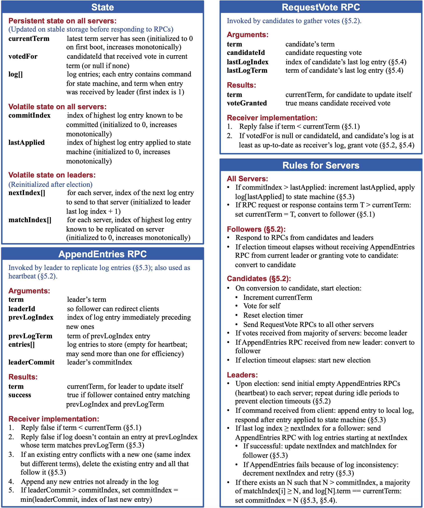

> 图 2：一个关于 Raft 一致性算法的浓缩总结（不包括成员变换和日志压缩）。

| 特性 | 解释 |
| --- | --- |
|选举安全特性| 对于一个给定的任期号，最多只会有一个领导人被选举出来（5.2 节）|
|领导人只附加原则| 领导人绝对不会删除或者覆盖自己的日志，只会增加（5.3 节）|
|日志匹配原则| 如果两个日志在某一相同索引位置日志条目的任期号相同，那么我们就认为这两个日志从头到该索引位置之间的内容完全一致（5.3 节）|
|领导人完全特性|如果某个日志条目在某个任期号中已经被提交，那么这个条目必然出现在更大任期号的所有领导人中（5.4 节）|
|状态机安全特性| 如果某一服务器已将给定索引位置的日志条目应用至其状态机中，则其他任何服务器在该索引位置不会应用不同的日志条目（5.4.3 节）|

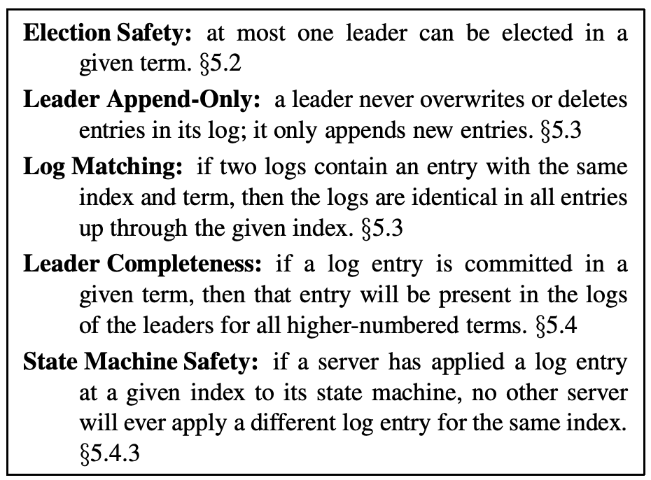

> 图 3：Raft 在任何时候都保证以上的各个特性。

### 5.1 Raft 基础

一个 Raft 集群包含若干个服务器节点；5 个服务器节点是一个典型的例子，这允许整个系统容忍 2 个节点失效。在任何时刻，每一个服务器节点都处于这三个状态之一：领导人、跟随者或者候选人。在通常情况下，系统中只有一个领导人并且其他的节点全部都是跟随者。跟随者都是被动的：他们不会发送任何请求，只是简单的响应来自领导人或者候选人的请求。领导人处理所有的客户端请求（如果一个客户端和跟随者联系，那么跟随者会把请求重定向给领导人）。第三种状态，候选人，是用来在 5.2 节描述的选举新领导人时使用。图 4 展示了这些状态和他们之间的转换关系；这些转换关系会在接下来进行讨论。

> 图 4：服务器状态。跟随者只响应来自其他服务器的请求。如果跟随者接收不到消息，那么他就会变成候选人并发起一次选举。获得集群中大多数选票的候选人将成为领导人。在一个任期内，领导人一直都会是领导人，直到自己宕机了。

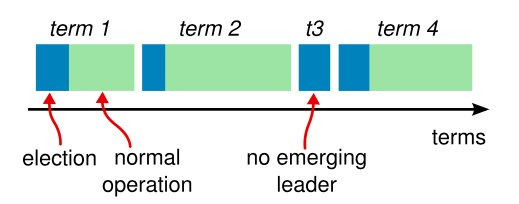

> 图 5：时间被划分成一个个的任期，每个任期始于一次选举。在选举成功后，领导人会管理整个集群直到任期结束。有时候选举会失败，那么这个任期就会没有领导人而结束。任期之间的切换可以在不同的时间不同的服务器上观察到。

Raft 把时间分割成任意长度的**任期**，如图 5。任期用连续的整数标记。每一段任期从一次**选举**开始，就像章节 5.2 描述的一样，一个或者多个候选人尝试成为领导人。如果一个候选人赢得选举，然后他就在接下来的任期内充当领导人的职责。在某些情况下，一次选举过程会造成选票的瓜分。在这种情况下，这一任期会以没有领导人结束；一个新的任期（和一次新的选举）会很快重新开始。Raft 保证了在一个给定的任期内，最多只有一个领导人。

不同的服务器节点可能多次观察到任期之间的转换，但在某些情况下，一个节点也可能观察不到任何一次选举或者整个任期全程。任期在 Raft 算法中充当逻辑时钟的作用，任期使得服务器可以检测一些过期的信息：比如过期的领导人。每个节点存储一个当前任期号，这一编号在整个时期内单调递增。每当服务器之间通信的时候都会交换当前任期号；如果一个服务器的当前任期号比其他人小，那么他会更新自己的任期号到较大的任期号值。如果一个候选人或者领导人发现自己的任期号过期了，那么他会立即恢复成跟随者状态。如果一个节点接收到一个包含过期的任期号的请求，那么他会直接拒绝这个请求。

Raft 算法中服务器节点之间通信使用远程过程调用（RPCs），并且基本的一致性算法只需要两种类型的 RPCs。请求投票（RequestVote） RPCs 由候选人在选举期间发起（章节  5.2），然后附加条目（AppendEntries）RPCs 由领导人发起，用来复制日志和提供一种心跳机制（章节 5.3）。第 7 节为了在服务器之间传输快照增加了第三种 RPC。当服务器没有及时的收到 RPC 的响应时，会进行重试， 并且他们能够并行的发起 RPCs 来获得最佳的性能。

### 5.2 领导人选举

Raft 使用一种心跳机制来触发领导人选举。当服务器程序启动时，他们都是跟随者身份。一个服务器节点继续保持着跟随者状态只要他从领导人或者候选人处接收到有效的 RPCs。领导人周期性的向所有跟随者发送心跳包（即不包含日志项内容的附加条目（AppendEntries） RPCs）来维持自己的权威。如果一个跟随者在一段时间里没有接收到任何消息，也就是**选举超时**，那么他就会认为系统中没有可用的领导人,并且发起选举以选出新的领导人。

要开始一次选举过程，跟随者先要增加自己的当前任期号并且转换到候选人状态。然后他会并行地向集群中的其他服务器节点发送请求投票的 RPCs 来给自己投票。候选人会继续保持着当前状态直到以下三件事情之一发生：(a) 他自己赢得了这次的选举，(b) 其他的服务器成为领导人，(c) 一段时间之后没有任何一个获胜的人。这些结果会分别的在下面的段落里进行讨论。

当一个候选人从整个集群的大多数服务器节点获得了针对同一个任期号的选票，那么他就赢得了这次选举并成为领导人。每一个服务器最多会对一个任期号投出一张选票，按照先来先服务的原则（注意：5.4 节在投票上增加了一点额外的限制）。要求大多数选票的规则确保了最多只会有一个候选人赢得此次选举（图 3 中的选举安全性）。一旦候选人赢得选举，他就立即成为领导人。然后他会向其他的服务器发送心跳消息来建立自己的权威并且阻止发起新的选举。

在等待投票的时候，候选人可能会从其他的服务器接收到声明它是领导人的附加条目（AppendEntries）RPC。如果这个领导人的任期号（包含在此次的 RPC中）不小于候选人当前的任期号，那么候选人会承认领导人合法并回到跟随者状态。 如果此次 RPC 中的任期号比自己小，那么候选人就会拒绝这次的 RPC 并且继续保持候选人状态。

第三种可能的结果是候选人既没有赢得选举也没有输：如果有多个跟随者同时成为候选人，那么选票可能会被瓜分以至于没有候选人可以赢得大多数人的支持。当这种情况发生的时候，每一个候选人都会超时，然后通过增加当前任期号来开始一轮新的选举。然而，没有其他机制的话，选票可能会被无限的重复瓜分。

Raft 算法使用随机选举超时时间的方法来确保很少会发生选票瓜分的情况，就算发生也能很快的解决。为了阻止选票起初就被瓜分，选举超时时间是从一个固定的区间（例如 150-300 毫秒）随机选择。这样可以把服务器都分散开以至于在大多数情况下只有一个服务器会选举超时；然后他赢得选举并在其他服务器超时之前发送心跳包。同样的机制被用在选票瓜分的情况下。每一个候选人在开始一次选举的时候会重置一个随机的选举超时时间，然后在超时时间内等待投票的结果；这样减少了在新的选举中另外的选票瓜分的可能性。9.3 节展示了这种方案能够快速的选出一个领导人。

领导人选举这个例子，体现了可理解性原则是如何指导我们进行方案设计的。起初我们计划使用一种排名系统：每一个候选人都被赋予一个唯一的排名，供候选人之间竞争时进行选择。如果一个候选人发现另一个候选人拥有更高的排名，那么他就会回到跟随者状态，这样高排名的候选人能够更加容易的赢得下一次选举。但是我们发现这种方法在可用性方面会有一点问题（如果高排名的服务器宕机了，那么低排名的服务器可能会超时并再次进入候选人状态。而且如果这个行为发生得足够快，则可能会导致整个选举过程都被重置掉）。我们针对算法进行了多次调整，但是每次调整之后都会有新的问题。最终我们认为随机重试的方法是更加明显和易于理解的。

### 5.3 日志复制

一旦一个领导人被选举出来，他就开始为客户端提供服务。客户端的每一个请求都包含一条被复制状态机执行的指令。领导人把这条指令作为一条新的日志条目附加到日志中去，然后并行地发起附加条目 RPCs 给其他的服务器，让他们复制这条日志条目。当这条日志条目被安全地复制（下面会介绍），领导人会应用这条日志条目到它的状态机中然后把执行的结果返回给客户端。如果跟随者崩溃或者运行缓慢，再或者网络丢包，领导人会不断的重复尝试附加日志条目 RPCs （尽管已经回复了客户端）直到所有的跟随者都最终存储了所有的日志条目。

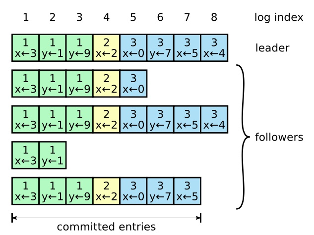

> 图 6：日志由有序序号标记的条目组成。每个条目都包含创建时的任期号（图中框中的数字），和一个状态机需要执行的指令。一个条目当可以安全地被应用到状态机中去的时候，就认为是可以提交了。

日志以图 6 展示的方式组织。每一个日志条目存储一条状态机指令和从领导人收到这条指令时的任期号。日志中的任期号用来检查是否出现不一致的情况，同时也用来保证图 3 中的某些性质。每一条日志条目同时也都有一个整数索引值来表明它在日志中的位置。

领导人来决定什么时候把日志条目应用到状态机中是安全的；这种日志条目被称为**已提交**。Raft 算法保证所有已提交的日志条目都是持久化的并且最终会被所有可用的状态机执行。在领导人将创建的日志条目复制到大多数的服务器上的时候，日志条目就会被提交（例如在图 6 中的条目 7）。同时，领导人的日志中之前的所有日志条目也都会被提交，包括由其他领导人创建的条目。5.4 节会讨论某些当在领导人改变之后应用这条规则的隐晦内容，同时他也展示了这种提交的定义是安全的。领导人跟踪了最大的将会被提交的日志项的索引，并且索引值会被包含在未来的所有附加日志 RPCs （包括心跳包），这样其他的服务器才能最终知道领导人的提交位置。一旦跟随者知道一条日志条目已经被提交，那么他也会将这个日志条目应用到本地的状态机中（按照日志的顺序）。

我们设计了 Raft 的日志机制来维护不同服务器日志之间的高层次的一致性。这么做不仅简化了系统的行为也使其更具有可预测性，同时它也是安全性保证的一个重要组件。Raft 维护着以下的特性，这些特性共同组成了图 3 中的**日志匹配特性（Log Matching Property）**：

* 如果在不同的日志中的两个条目拥有相同的索引和任期号，那么他们存储了相同的指令。
* 如果在不同的日志中的两个条目拥有相同的索引和任期号，那么他们之前的所有日志条目也全部相同。

第一个特性来自这样的一个事实，领导人最多在一个任期里在指定的一个日志索引位置创建一条日志条目，同时日志条目在日志中的位置也从来不会改变。第二个特性由附加日志 RPC 的一个简单的一致性检查所保证。在发送附加日志 RPC 的时候，领导人会把新的日志条目前紧挨着的条目的索引位置和任期号包含在日志内。如果跟随者在它的日志中找不到包含相同索引位置和任期号的条目，那么他就会拒绝接收新的日志条目。一致性检查就像一个归纳步骤：一开始空的日志状态肯定是满足日志匹配特性的，然后一致性检查在日志扩展的时候保护了日志匹配特性。因此，每当附加日志 RPC 返回成功时，领导人就知道跟随者的日志一定是和自己相同的了。

在正常的操作中，领导人和跟随者的日志保持一致性，所以附加日志 RPC 的一致性检查从来不会失败。然而，领导人崩溃的情况会使得日志处于不一致的状态（老的领导人可能还没有完全复制所有的日志条目）。这种不一致问题会在领导人和跟随者的一系列崩溃下加剧。图 7 展示了跟随者的日志可能和新的领导人不同。跟随者可能会丢失一些在新的领导人中存在的日志条目，他也可能拥有一些领导人没有的日志条目，或者两者都发生。丢失或者多出日志条目可能会持续多个任期。

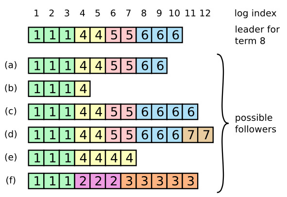

> 图 7：当一个领导人成功当选时，跟随者可能是任何情况（a-f）。每一个盒子表示是一个日志条目；里面的数字表示任期号。跟随者可能会缺少一些日志条目（a-b），可能会有一些未被提交的日志条目（c-d），或者两种情况都存在（e-f）。例如，场景 f 可能会这样发生，某服务器在任期 2 的时候是领导人，已附加了一些日志条目到自己的日志中，但在提交之前就崩溃了；很快这个机器就被重启了，在任期 3 重新被选为领导人，并且又增加了一些日志条目到自己的日志中；在任期 2 和任期 3 的日志被提交之前，这个服务器又宕机了，并且在接下来的几个任期里一直处于宕机状态。

在 Raft 算法中，领导人是通过强制跟随者直接复制自己的日志来处理不一致问题的。这意味着在跟随者中的冲突的日志条目会被领导人的日志覆盖。5.4 节会阐述如何通过增加一些限制来使得这样的操作是安全的。

要使得跟随者的日志进入和自己一致的状态，领导人必须找到最后两者达成一致的地方，然后删除跟随者从那个点之后的所有日志条目，并发送自己在那个点之后的日志给跟随者。所有的这些操作都在进行附加日志 RPCs 的一致性检查时完成。领导人针对每一个跟随者维护了一个 **nextIndex**，这表示下一个需要发送给跟随者的日志条目的索引地址。当一个领导人刚获得权力的时候，他初始化所有的 nextIndex 值为自己的最后一条日志的 index 加 1（图 7 中的 11）。如果一个跟随者的日志和领导人不一致，那么在下一次的附加日志 RPC 时的一致性检查就会失败。在被跟随者拒绝之后，领导人就会减小 nextIndex 值并进行重试。最终 nextIndex 会在某个位置使得领导人和跟随者的日志达成一致。当这种情况发生，附加日志 RPC 就会成功，这时就会把跟随者冲突的日志条目全部删除并且加上领导人的日志。一旦附加日志 RPC 成功，那么跟随者的日志就会和领导人保持一致，并且在接下来的任期里一直继续保持。

> 如果需要的话，算法可以通过减少被拒绝的附加日志 RPCs 的次数来优化。例如，当附加日志 RPC 的请求被拒绝的时候，跟随者可以(返回)冲突条目的任期号和该任期号对应的最小索引地址。借助这些信息，领导人可以减小 nextIndex 一次性越过该冲突任期的所有日志条目；这样就变成每个任期需要一次附加条目 RPC 而不是每个条目一次。在实践中，我们十分怀疑这种优化是否是必要的，因为失败是很少发生的并且也不大可能会有这么多不一致的日志。

通过这种机制，领导人在获得权力的时候就不需要任何特殊的操作来恢复一致性。他只需要进行正常的操作，然后日志就能在回复附加日志 RPC 的一致性检查失败的时候自动趋于一致。领导人从来不会覆盖或者删除自己的日志（图 3 的领导人只附加特性）。

日志复制机制展示出了第 2 节中形容的一致性特性：Raft 能够接受，复制并应用新的日志条目只要大部分的机器是工作的；在通常的情况下，新的日志条目可以在一次 RPC 中被复制给集群中的大多数机器；并且单个的缓慢的跟随者不会影响整体的性能。

### 5.4 安全性

前面的章节里描述了 Raft 算法是如何选举和复制日志的。然而，到目前为止描述的机制并不能充分的保证每一个状态机会按照相同的顺序执行相同的指令。例如，一个跟随者可能会进入不可用状态同时领导人已经提交了若干的日志条目，然后这个跟随者可能会被选举为领导人并且覆盖这些日志条目；因此，不同的状态机可能会执行不同的指令序列。

这一节通过在领导选举的时候增加一些限制来完善 Raft 算法。这一限制保证了任何的领导人对于给定的任期号，都拥有了之前任期的所有被提交的日志条目（图 3 中的领导人完整特性）。增加这一选举时的限制，我们对于提交时的规则也更加清晰。最终，我们将展示对于**领导人完整特性（Leader Completeness Property）** 的简要证明，并且说明该特性是如何引导复制状态机做出正确行为的。

#### 5.4.1 选举限制

在任何基于领导人的一致性算法中，领导人都必须存储所有已经提交的日志条目。在某些一致性算法中，例如 Viewstamped Replication，某个节点即使是一开始并没有包含所有已经提交的日志条目，它也能被选为领导人。这些算法都包含一些额外的机制来识别丢失的日志条目并把他们传送给新的领导人，要么是在选举阶段要么在之后很快进行。不幸的是，这种方法会导致相当大的额外的机制和复杂性。Raft 使用了一种更加简单的方法，它可以保证在选举的时候新的领导人拥有所有之前任期中已经提交的日志条目，而不需要传送这些日志条目给领导人。这意味着日志条目的传送是单向的，只从领导人传给跟随者，并且领导人从不会覆盖自身本地日志中已经存在的条目。

Raft 使用投票的方式来阻止一个候选人赢得选举，除非这个候选人包含了所有已经提交的日志条目。候选人为了赢得选举必须联系集群中的大部分节点，这意味着每一个已经提交的日志条目在这些服务器节点中肯定存在于至少一个节点上。如果候选人的日志至少和大多数的服务器节点一样新（这个新的定义会在下面讨论），那么他一定持有了所有已经提交的日志条目。请求投票（RequestVote） RPC 实现了这样的限制：RPC 中包含了候选人的日志信息，然后投票人会拒绝掉那些日志没有自己新的投票请求。

Raft 通过比较两份日志中最后一条日志条目的索引值和任期号定义谁的日志比较新。如果两份日志最后的条目的任期号不同，那么任期号大的日志更加新。如果两份日志最后的条目任期号相同，那么日志比较长的那个就更加新。

#### 5.4.2 提交之前任期内的日志条目

如同 5.3 节介绍的那样，领导人知道一条当前任期内的日志记录是可以被提交的，只要它被存储到了大多数的服务器上。如果一个领导人在提交日志条目之前崩溃了，未来后续的领导人会继续尝试复制这条日志记录。然而，一个领导人不能断定一个之前任期里的日志条目被保存到大多数服务器上的时候就一定已经提交了。图 8 展示了一种情况，一条已经被存储到大多数节点上的老日志条目，也依然有可能会被未来的领导人覆盖掉。

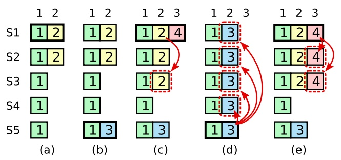

> 图 8：如图的时间序列展示了为什么领导人无法决定对老任期号的日志条目进行提交。在 (a) 中，S1 是领导人，部分的(跟随者)复制了索引位置 2 的日志条目。在 (b) 中，S1 崩溃了，然后 S5 在任期 3 里通过 S3、S4 和自己的选票赢得选举，然后从客户端接收了一条不一样的日志条目放在了索引 2 处。然后到 (c)，S5 又崩溃了；S1 重新启动，选举成功，开始复制日志。在这时，来自任期 2 的那条日志已经被复制到了集群中的大多数机器上，但是还没有被提交。如果 S1 在 (d) 中又崩溃了，S5 可以重新被选举成功（通过来自 S2，S3 和 S4 的选票），然后覆盖了他们在索引 2 处的日志。反之，如果在崩溃之前，S1 把自己主导的新任期里产生的日志条目复制到了大多数机器上，就如 (e) 中那样，那么在后面任期里面这些新的日志条目就会被提交（因为 S5 就不可能选举成功）。 这样在同一时刻就同时保证了，之前的所有老的日志条目就会被提交。

为了消除图 8 里描述的情况，Raft 永远不会通过计算副本数目的方式去提交一个之前任期内的日志条目。只有领导人当前任期里的日志条目通过计算副本数目可以被提交；一旦当前任期的日志条目以这种方式被提交，那么由于日志匹配特性，之前的日志条目也都会被间接的提交。在某些情况下，领导人可以安全的知道一个老的日志条目是否已经被提交（例如，该条目是否存储到所有服务器上），但是 Raft 为了简化问题使用一种更加保守的方法。

当领导人复制之前任期里的日志时，Raft 会为所有日志保留原始的任期号, 这在提交规则上产生了额外的复杂性。在其他的一致性算法中，如果一个新的领导人要重新复制之前的任期里的日志时，它必须使用当前新的任期号。Raft 使用的方法更加容易辨别出日志，因为它可以随着时间和日志的变化对日志维护着同一个任期编号。另外，和其他的算法相比，Raft 中的新领导人只需要发送更少日志条目（其他算法中必须在他们被提交之前发送更多的冗余日志条目来为他们重新编号）。

#### 5.4.3 安全性论证

在给定了完整的 Raft 算法之后，我们现在可以更加精确的讨论领导人完整性特性（这一讨论基于 9.2 节的安全性证明）。我们假设领导人完全性特性是不存在的，然后我们推出矛盾来。假设任期 T 的领导人（领导人 T）在任期内提交了一条日志条目，但是这条日志条目没有被存储到未来某个任期的领导人的日志中。设大于 T 的最小任期 U 的领导人 U 没有这条日志条目。

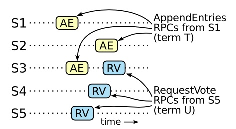

> 图 9：如果 S1 （任期 T 的领导人）在它的任期里提交了一条新的日志，然后 S5 在之后的任期 U 里被选举为领导人，那么至少会有一个机器，如 S3，既拥有来自 S1 的日志，也给 S5 投票了。

1. 在领导人 U 选举的时候一定没有那条被提交的日志条目（领导人从不会删除或者覆盖任何条目）。
2. 领导人 T 复制这条日志条目给集群中的大多数节点，同时，领导人 U 从集群中的大多数节点赢得了选票。因此，至少有一个节点（投票者、选民）同时接受了来自领导人 T 的日志条目，并且给领导人 U 投票了，如图 9。这个投票者是产生这个矛盾的关键。
3. 这个投票者必须在给领导人 U 投票之前先接受了从领导人 T 发来的已经被提交的日志条目；否则他就会拒绝来自领导人 T 的附加日志请求（因为此时他的任期号会比 T 大）。
4. 投票者在给领导人 U 投票时依然保存有这条日志条目，因为任何中间的领导人都包含该日志条目（根据上述的假设），领导人从不会删除条目，并且跟随者只有在和领导人冲突的时候才会删除条目。
5. 投票者把自己选票投给领导人 U 时，领导人 U 的日志必须和投票者自己一样新。这就导致了两者矛盾之一。
6. 首先，如果投票者和领导人 U 的最后一条日志的任期号相同，那么领导人 U 的日志至少和投票者一样长，所以领导人 U 的日志一定包含所有投票者的日志。这是另一处矛盾，因为投票者包含了那条已经被提交的日志条目，但是在上述的假设里，领导人 U 是不包含的。
7. 除此之外，领导人 U 的最后一条日志的任期号就必须比投票人大了。此外，他也比 T 大，因为投票人的最后一条日志的任期号至少和 T 一样大（他包含了来自任期 T 的已提交的日志）。创建了领导人 U 最后一条日志的之前领导人一定已经包含了那条被提交的日志（根据上述假设，领导人 U 是第一个不包含该日志条目的领导人）。所以，根据日志匹配特性，领导人 U 一定也包含那条被提交的日志，这里产生矛盾。
8. 这里完成了矛盾。因此，所有比 T 大的领导人一定包含了所有来自 T 的已经被提交的日志。
9. 日志匹配原则保证了未来的领导人也同时会包含被间接提交的条目，例如图 8 (e) 中的索引 2。

通过领导人完全特性，我们就能证明图 3 中的状态机安全特性，即如果服务器已经在某个给定的索引值应用了日志条目到自己的状态机里，那么其他的服务器不会应用一个不一样的日志到同一个索引值上。在一个服务器应用一条日志条目到他自己的状态机中时，他的日志必须和领导人的日志，在该条目和之前的条目上相同，并且已经被提交。现在我们来考虑在任何一个服务器应用一个指定索引位置的日志的最小任期；日志完全特性保证拥有更高任期号的领导人会存储相同的日志条目，所以之后的任期里应用某个索引位置的日志条目也会是相同的值。因此，状态机安全特性是成立的。

最后，Raft 要求服务器按照日志中索引位置顺序应用日志条目。和状态机安全特性结合起来看，这就意味着所有的服务器会应用相同的日志序列集到自己的状态机中，并且是按照相同的顺序。

### 5.5 跟随者和候选人崩溃

到目前为止，我们都只关注了领导人崩溃的情况。跟随者和候选人崩溃后的处理方式比领导人要简单的多，并且他们的处理方式是相同的。如果跟随者或者候选人崩溃了，那么后续发送给他们的 RPCs 都会失败。Raft 中处理这种失败就是简单地通过无限的重试；如果崩溃的机器重启了，那么这些 RPC 就会完整的成功。如果一个服务器在完成了一个 RPC，但是还没有响应的时候崩溃了，那么在他重新启动之后就会再次收到同样的请求。Raft 的 RPCs 都是幂等的，所以这样重试不会造成任何问题。例如一个跟随者如果收到附加日志请求但是他已经包含了这一日志，那么他就会直接忽略这个新的请求。

### 5.6 时间和可用性

Raft 的要求之一就是安全性不能依赖时间：整个系统不能因为某些事件运行的比预期快一点或者慢一点就产生了错误的结果。但是，可用性（系统可以及时的响应客户端）不可避免的要依赖于时间。例如，如果消息交换比服务器故障间隔时间长，候选人将没有足够长的时间来赢得选举；没有一个稳定的领导人，Raft 将无法工作。

领导人选举是 Raft 中对时间要求最为关键的方面。Raft 可以选举并维持一个稳定的领导人,只要系统满足下面的时间要求：

> 广播时间（broadcastTime）  <<  选举超时时间（electionTimeout） <<  平均故障间隔时间（MTBF）

在这个不等式中，广播时间指的是从一个服务器并行的发送 RPCs 给集群中的其他服务器并接收响应的平均时间；选举超时时间就是在 5.2 节中介绍的选举的超时时间限制；然后平均故障间隔时间就是对于一台服务器而言，两次故障之间的平均时间。广播时间必须比选举超时时间小一个量级，这样领导人才能够发送稳定的心跳消息来阻止跟随者开始进入选举状态；通过随机化选举超时时间的方法，这个不等式也使得选票瓜分的情况变得不可能。选举超时时间应该要比平均故障间隔时间小上几个数量级，这样整个系统才能稳定的运行。当领导人崩溃后，整个系统会大约相当于选举超时的时间里不可用；我们希望这种情况在整个系统的运行中很少出现。

广播时间和平均故障间隔时间是由系统决定的，但是选举超时时间是我们自己选择的。Raft 的 RPCs 需要接收方将信息持久化的保存到稳定存储中去，所以广播时间大约是 0.5 毫秒到 20 毫秒，取决于存储的技术。因此，选举超时时间可能需要在 10 毫秒到 500 毫秒之间。大多数的服务器的平均故障间隔时间都在几个月甚至更长，很容易满足时间的需求。

## 6 集群成员变化

到目前为止，我们都假设集群的配置（加入到一致性算法的服务器集合）是固定不变的。但是在实践中，偶尔是会改变集群的配置的，例如替换那些宕机的机器或者改变复制级别。尽管可以通过暂停整个集群，更新所有配置，然后重启整个集群的方式来实现，但是在更改的时候集群会不可用。另外，如果存在手工操作步骤，那么就会有操作失误的风险。为了避免这样的问题，我们决定自动化配置改变并且将其纳入到 Raft 一致性算法中来。

为了让配置修改机制能够安全，那么在转换的过程中不能够存在任何时间点使得两个领导人在同一个任期里同时被选举成功。不幸的是，任何服务器直接从旧的配置直接转换到新的配置的方案都是不安全的。一次性原子地转换所有服务器是不可能的，所以在转换期间整个集群存在划分成两个独立的大多数群体的可能性（见图 10）。

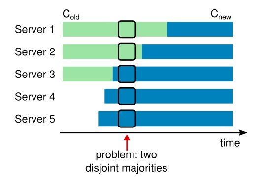

> 图 10：直接从一种配置转到新的配置是十分不安全的，因为各个机器可能在任何的时候进行转换。在这个例子中，集群配额从 3 台机器变成了 5 台。不幸的是，存在这样的一个时间点，两个不同的领导人在同一个任期里都可以被选举成功。一个是通过旧的配置，一个通过新的配置。

为了保证安全性，配置更改必须使用两阶段方法。目前有很多种两阶段的实现。例如，有些系统在第一阶段停掉旧的配置所以集群就不能处理客户端请求；然后在第二阶段在启用新的配置。在 Raft 中，集群先切换到一个过渡的配置，我们称之为共同一致（*joint consensus*)；一旦共同一致已经被提交了，那么系统就切换到新的配置上。共同一致是老配置和新配置的结合：

* 日志条目被复制给集群中新、老配置的所有服务器。
* 新、旧配置的服务器都可以成为领导人。
* 达成一致（针对选举和提交）需要分别在两种配置上获得大多数的支持。

共同一致允许独立的服务器在不影响安全性的前提下，在不同的时间进行配置转换过程。此外，共同一致可以让集群在配置转换的过程中依然响应客户端的请求。

集群配置在复制日志中以特殊的日志条目来存储和通信；图 11 展示了配置转换的过程。当一个领导人接收到一个改变配置从 C-old 到 C-new 的请求，他会为了共同一致存储配置（图中的 C-old,new），以前面描述的日志条目和副本的形式。一旦一个服务器将新的配置日志条目增加到它的日志中，他就会用这个配置来做出未来所有的决定（服务器总是使用最新的配置，无论他是否已经被提交）。这意味着领导人要使用  C-old,new 的规则来决定日志条目 C-old,new 什么时候需要被提交。如果领导人崩溃了，被选出来的新领导人可能是使用 C-old 配置也可能是 C-old,new 配置，这取决于赢得选举的候选人是否已经接收到了 C-old,new 配置。在任何情况下， C-new 配置在这一时期都不会单方面的做出决定。

一旦 C-old,new 被提交，那么无论是 C-old 还是 C-new，如果不经过另一个配置的允许都不能单独做出决定，并且领导人完全特性保证了只有拥有 C-old,new 日志条目的服务器才有可能被选举为领导人。这个时候，领导人创建一条关于 C-new 配置的日志条目并复制给集群就是安全的了。再者，每个服务器在见到新的配置的时候就会立即生效。当新的配置在 C-new 的规则下被提交，旧的配置就变得无关紧要，同时不使用新的配置的服务器就可以被关闭了。如图 11，C-old 和 C-new 没有任何机会同时做出单方面的决定；这保证了安全性。

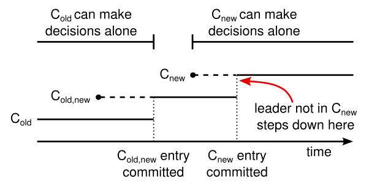

> 图 11：一个配置切换的时间线。虚线表示已经被创建但是还没有被提交的配置日志条目，实线表示最后被提交的配置日志条目。领导人首先创建了 C-old,new 的配置条目在自己的日志中，并提交到 C-old,new 中（C-old 的大多数和  C-new 的大多数）。然后他创建 C-new 条目并提交到 C-new 中的大多数。这样就不存在  C-new 和 C-old 可以同时做出决定的时间点。

在关于重新配置还有三个问题需要提出。第一个问题是，新的服务器可能初始化没有存储任何的日志条目。当这些服务器以这种状态加入到集群中，那么他们需要一段时间来更新追赶，这时还不能提交新的日志条目。为了避免这种可用性的间隔时间，Raft 在配置更新之前使用了一种额外的阶段，在这个阶段，新的服务器以没有投票权身份加入到集群中来（领导人复制日志给他们，但是不考虑他们是大多数）。一旦新的服务器追赶上了集群中的其他机器，重新配置可以像上面描述的一样处理。

第二个问题是，集群的领导人可能不是新配置的一员。在这种情况下，领导人就会在提交了 C-new 日志之后退位（回到跟随者状态）。这意味着有这样的一段时间，领导人管理着集群，但是不包括他自己；他复制日志但是不把他自己算作是大多数之一。当 C-new 被提交时，会发生领导人过渡，因为这时是最早新的配置可以独立工作的时间点（将总是能够在 C-new 配置下选出新的领导人）。在此之前，可能只能从 C-old 中选出领导人。

第三个问题是，移除不在 C-new 中的服务器可能会扰乱集群。这些服务器将不会再接收到心跳，所以当选举超时，他们就会进行新的选举过程。他们会发送拥有新的任期号的请求投票 RPCs，这样会导致当前的领导人回退成跟随者状态。新的领导人最终会被选出来，但是被移除的服务器将会再次超时，然后这个过程会再次重复，导致整体可用性大幅降低。

为了避免这个问题，当服务器确认当前领导人存在时，服务器会忽略请求投票 RPCs。确切地说，当服务器在当前最小选举超时时间内收到一个请求投票 RPC，他不会更新当前的任期号或者投出选票。这不会影响正常的选举，每个服务器在开始一次选举之前，至少等待一个最小选举超时时间。然而，这有利于避免被移除的服务器扰乱：如果领导人能够发送心跳给集群，那么他就不会被更大的任期号废黜。

## 7 日志压缩

Raft 的日志在正常操作中不断地增长，但是在实际的系统中，日志不能无限制地增长。随着日志不断增长，他会占用越来越多的空间，花费越来越多的时间来重置。如果没有一定的机制去清除日志里积累的陈旧的信息，那么会带来可用性问题。

快照是最简单的压缩方法。在快照系统中，整个系统的状态都以快照的形式写入到稳定的持久化存储中，然后到那个时间点之前的日志全部丢弃。快照技术被使用在 Chubby 和 ZooKeeper 中，接下来的章节会介绍 Raft 中的快照技术。

增量压缩的方法，例如日志清理或者日志结构合并树，都是可行的。这些方法每次只对一小部分数据进行操作，这样就分散了压缩的负载压力。首先，他们先选择一个已经积累的大量已经被删除或者被覆盖对象的区域，然后重写那个区域还活跃的对象，之后释放那个区域。和简单操作整个数据集合的快照相比，需要增加复杂的机制来实现。状态机可以实现 LSM tree 使用和快照相同的接口，但是日志清除方法就需要修改 Raft 了。

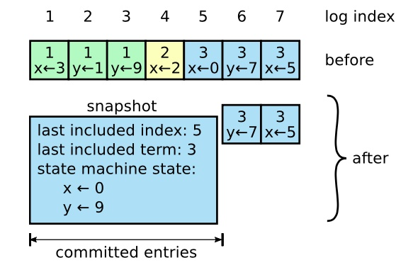

> 图 12：一个服务器用新的快照替换了从 1 到 5 的条目，快照值存储了当前的状态。快照中包含了最后的索引位置和任期号。

图 12 展示了 Raft 中快照的基础思想。每个服务器独立地创建快照，只包括已经被提交的日志。主要的工作包括将状态机的状态写入到快照中。Raft 也包含一些少量的元数据到快照中：**最后被包含索引**指的是被快照取代的最后的条目在日志中的索引值（状态机最后应用的日志），**最后被包含的任期**指的是该条目的任期号。保留这些数据是为了支持快照后紧接着的第一个条目的附加日志请求时的一致性检查，因为这个条目需要前一日志条目的索引值和任期号。为了支持集群成员更新（第 6 节），快照中也将最后的一次配置作为最后一个条目存下来。一旦服务器完成一次快照，他就可以删除最后索引位置之前的所有日志和快照了。

尽管通常服务器都是独立地创建快照，但是领导人必须偶尔的发送快照给一些落后的跟随者。这通常发生在当领导人已经丢弃了下一条需要发送给跟随者的日志条目的时候。幸运的是这种情况不是常规操作：一个与领导人保持同步的跟随者通常都会有这个条目。然而一个运行非常缓慢的跟随者或者新加入集群的服务器（第 6 节）将不会有这个条目。这时让这个跟随者更新到最新的状态的方式就是通过网络把快照发送给他们。

**安装快照 RPC**：

由领导人调用以将快照的分块发送给跟随者。领导人总是按顺序发送分块。

| 参数 | 解释 |
|----|----|
| term | 领导人的任期号 |
| leaderId | 领导人的 ID，以便于跟随者重定向请求 |
| lastIncludedIndex | 快照中包含的最后日志条目的索引值 |
| lastIncludedTerm | 快照中包含的最后日志条目的任期号 |
| offset | 分块在快照中的字节偏移量 |
| data[] | 从偏移量开始的快照分块的原始字节 |
| done | 如果这是最后一个分块则为 true |

| 结果 | 解释 |
|----|----|
| term | 当前任期号（currentTerm），便于领导人更新自己 |

**接收者实现**：

1. 如果`term < currentTerm`就立即回复
2. 如果是第一个分块（offset 为 0）就创建一个新的快照
3. 在指定偏移量写入数据
4. 如果 done 是 false，则继续等待更多的数据
5. 保存快照文件，丢弃具有较小索引的任何现有或部分快照
6. 如果现存的日志条目与快照中最后包含的日志条目具有相同的索引值和任期号，则保留其后的日志条目并进行回复
7. 丢弃整个日志
8. 使用快照重置状态机（并加载快照的集群配置）

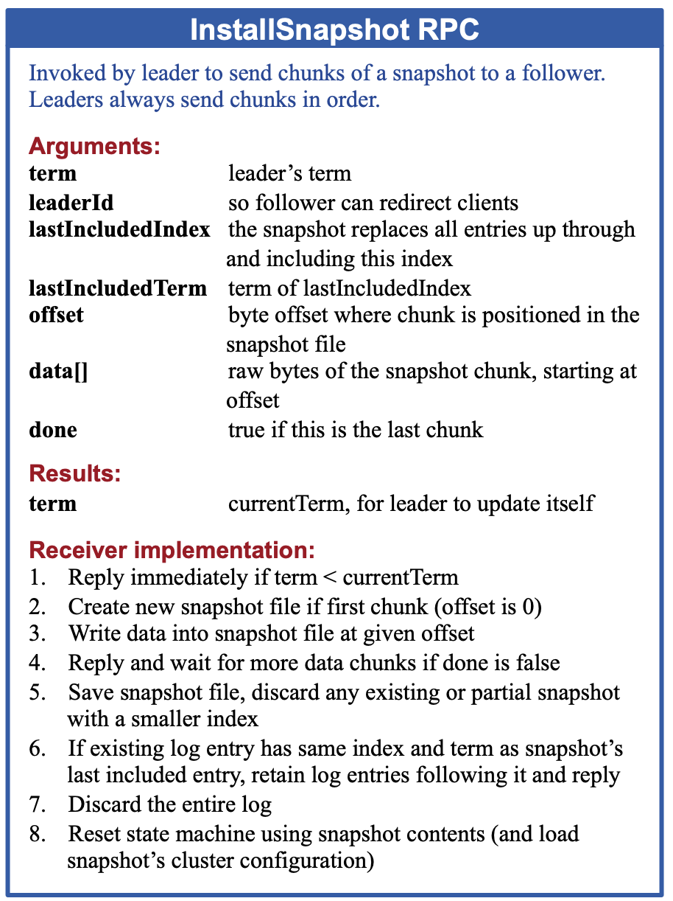

> 图 13：一个关于安装快照的简要概述。为了便于传输，快照都是被分成分块的；每个分块都给了跟随者生命的迹象，所以跟随者可以重置选举超时计时器。

在这种情况下领导人使用一种叫做安装快照的新的 RPC 来发送快照给太落后的跟随者；见图 13。当跟随者通过这种  RPC 接收到快照时，他必须自己决定对于已经存在的日志该如何处理。通常快照会包含没有在接收者日志中存在的信息。在这种情况下，跟随者丢弃其整个日志；它全部被快照取代，并且可能包含与快照冲突的未提交条目。如果接收到的快照是自己日志的前面部分（由于网络重传或者错误），那么被快照包含的条目将会被全部删除，但是快照后面的条目仍然有效，必须保留。

这种快照的方式背离了 Raft 的强领导人原则，因为跟随者可以在不知道领导人情况下创建快照。但是我们认为这种背离是值得的。领导人的存在，是为了解决在达成一致性的时候的冲突，但是在创建快照的时候，一致性已经达成，这时不存在冲突了，所以没有领导人也是可以的。数据依然是从领导人传给跟随者，只是跟随者可以重新组织他们的数据了。

我们考虑过一种替代的基于领导人的快照方案，即只有领导人创建快照，然后发送给所有的跟随者。但是这样做有两个缺点。第一，发送快照会浪费网络带宽并且延缓了快照处理的时间。每个跟随者都已经拥有了所有产生快照需要的信息，而且很显然，自己从本地的状态中创建快照比通过网络接收别人发来的要经济。第二，领导人的实现会更加复杂。例如，领导人需要发送快照的同时并行的将新的日志条目发送给跟随者，这样才不会阻塞新的客户端请求。

还有两个问题影响了快照的性能。首先，服务器必须决定什么时候应该创建快照。如果快照创建的过于频繁，那么就会浪费大量的磁盘带宽和其他资源；如果创建快照频率太低，他就要承受耗尽存储容量的风险，同时也增加了从日志重建的时间。一个简单的策略就是当日志大小达到一个固定大小的时候就创建一次快照。如果这个阈值设置的显著大于期望的快照的大小，那么快照对磁盘压力的影响就会很小了。

第二个影响性能的问题就是写入快照需要花费显著的一段时间，并且我们还不希望影响到正常操作。解决方案是通过写时复制的技术，这样新的更新就可以被接收而不影响到快照。例如，具有函数式数据结构的状态机天然支持这样的功能。另外，操作系统的写时复制技术的支持（如 Linux 上的 fork）可以被用来创建完整的状态机的内存快照（我们的实现就是这样的）。

## 8 客户端交互

这一节将介绍客户端是如何和 Raft 进行交互的，包括客户端如何发现领导人和 Raft 是如何支持线性化语义的。这些问题对于所有基于一致性的系统都存在，并且 Raft 的解决方案和其他的也差不多。

Raft 中的客户端发送所有请求给领导人。当客户端启动的时候，他会随机挑选一个服务器进行通信。如果客户端第一次挑选的服务器不是领导人，那么那个服务器会拒绝客户端的请求并且提供他最近接收到的领导人的信息（附加条目请求包含了领导人的网络地址）。如果领导人已经崩溃了，那么客户端的请求就会超时；客户端之后会再次重试随机挑选服务器的过程。

我们 Raft 的目标是要实现线性化语义（每一次操作立即执行，只执行一次，在他调用和收到回复之间）。但是，如上述，Raft 是可能执行同一条命令多次的：例如，如果领导人在提交了这条日志之后，但是在响应客户端之前崩溃了，那么客户端会和新的领导人重试这条指令，导致这条命令就被再次执行了。解决方案就是客户端对于每一条指令都赋予一个唯一的序列号。然后，状态机跟踪每条指令最新的序列号和相应的响应。如果接收到一条指令，它的序列号已经被执行了，那么就立即返回结果，而不重新执行指令。

只读的操作可以直接处理而不需要记录日志。但是，在不增加任何限制的情况下，这么做可能会冒着返回脏数据的风险，因为响应客户端请求的领导人可能在他不知道的时候已经被新的领导人取代了。线性化的读操作必须不能返回脏数据，Raft 需要使用两个额外的措施在不使用日志的情况下保证这一点。首先，领导人必须有关于被提交日志的最新信息。领导人完全特性保证了领导人一定拥有所有已经被提交的日志条目，但是在他任期开始的时候，他可能不知道哪些是已经被提交的。为了知道这些信息，他需要在他的任期里提交一条日志条目。Raft 中通过领导人在任期开始的时候提交一个空白的没有任何操作的日志条目到日志中去来实现。第二，领导人在处理只读的请求之前必须检查自己是否已经被废黜了（他自己的信息已经变脏了如果一个更新的领导人被选举出来）。Raft 中通过让领导人在响应只读请求之前，先和集群中的大多数节点交换一次心跳信息来处理这个问题。可选的，领导人可以依赖心跳机制来实现一种租约的机制，但是这种方法依赖时间来保证安全性（假设时间误差是有界的）。

## 9 算法实现和评估

我们已经为 RAMCloud 实现了 Raft 算法作为存储配置信息的复制状态机的一部分，并且帮助 RAMCloud 协调故障转移。这个 Raft 实现包含大约 2000 行 C++ 代码，其中不包括测试、注释和空行。这些代码是开源的。同时也有大约 25 个其他独立的第三方的基于这篇论文草稿的开源实现，针对不同的开发场景。同时，很多公司已经部署了基于 Raft 的系统。

这一节会从三个方面来评估 Raft 算法：可理解性、正确性和性能。

### 9.1 可理解性

为了和 Paxos 比较 Raft 算法的可理解能力，我们针对高层次的本科生和研究生，在斯坦福大学的高级操作系统课程和加州大学伯克利分校的分布式计算课程上，进行了一次学习的实验。我们分别拍了针对 Raft 和 Paxos 的视频课程，并准备了相应的小测验。Raft 的视频讲课覆盖了这篇论文的所有内容除了日志压缩；Paxos 讲课包含了足够的资料来创建一个等价的复制状态机，包括单决策 Paxos，多决策 Paxos，重新配置和一些实际系统需要的性能优化（例如领导人选举）。小测验测试一些对算法的基本理解和解释一些边角的示例。每个学生都是看完第一个视频，回答相应的测试，再看第二个视频，回答相应的测试。大约有一半的学生先进行 Paxos 部分，然后另一半先进行 Raft 部分，这是为了说明两者从第一部分的算法学习中获得的表现和经验的差异。我们计算参加人员的每一个小测验的得分来看参与者是否在 Raft 算法上更加容易理解。

我们尽可能的使得 Paxos 和 Raft 的比较更加公平。这个实验偏爱 Paxos 表现在两个方面：43 个参加者中有 15 个人在之前有一些  Paxos 的经验，并且 Paxos 的视频要长 14%。如表格 1 总结的那样，我们采取了一些措施来减轻这种潜在的偏见。我们所有的材料都可供审查。

| 关心 | 缓和偏见采取的手段 | 可供查看的材料 |
|----|----|----|
| 相同的讲课质量 | 两者使用同一个讲师。Paxos 使用的是现在很多大学里经常使用的。Paxos 会长 14%。 | 视频 |
| 相同的测验难度 | 问题以难度分组，在两个测验里成对出现。| 小测验 |
| 公平评分 | 使用评价量规。随机顺序打分，两个测验交替进行。 | 评价量规（rubric） |

> 表 1：考虑到可能会存在的偏见，对于每种情况的解决方法，和相应的材料。

参加者平均在 Raft 的测验中比 Paxos 高 4.9 分（总分 60，那么 Raft 的平均得分是 25.7，而 Paxos 是 20.8）；图 14 展示了每个参与者的得分。配置t-检验（又称student‘s t-test）表明，在 95% 的可信度下，真实的 Raft 分数分布至少比 Paxos 高 2.5 分。

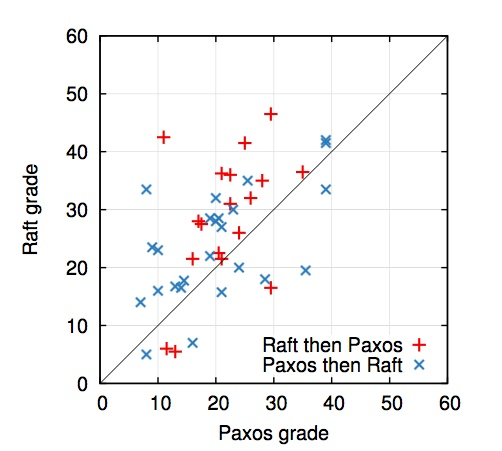

> 图 14：一个散点图表示了 43 个学生在 Paxos 和 Raft 的小测验中的成绩。在对角线之上的点表示在 Raft 获得了更高分数的学生。

我们也建立了一个线性回归模型来预测一个新的学生的测验成绩，基于以下三个因素：他们使用的是哪个小测验，之前对 Paxos 的经验，和学习算法的顺序。模型预测，对小测验的选择会产生 12.5 分的差别。这显著的高于之前的 4.9 分，因为很多学生在之前都已经有了对于 Paxos 的经验，这相当明显的帮助 Paxos，对 Raft 就没什么太大影响了。但是奇怪的是，模型预测对于先进行 Paxos 小测验的人而言，Raft的得分低了6.3分; 虽然我们不知道为什么，这似乎在统计上是有意义的。

我们同时也在测验之后调查了参与者，他们认为哪个算法更加容易实现和解释；这个的结果在图 15 上。压倒性的结果表明 Raft 算法更加容易实现和解释（41 人中的 33个）。但是，这种自己报告的结果不如参与者的成绩更加可信，并且参与者可能因为我们的 Raft 更加易于理解的假说而产生偏见。

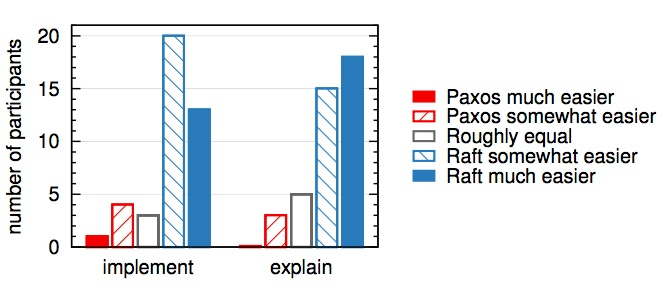

> 图 15：通过一个 5 分制的问题，参与者（左边）被问哪个算法他们觉得在一个高效正确的系统里更容易实现，右边被问哪个更容易向学生解释。

关于 Raft 用户学习有一个更加详细的讨论。

### 9.2 正确性

在第 5 节，我们已经制定了正式的规范，和对一致性机制的安全性证明。这个正式规范使用 TLA+ 规范语言使图 2 中总结的信息非常清晰。它长约400行，并作为证明的主题。同时对于任何想实现 Raft 的人也是十分有用的。我们通过 TLA 证明系统非常机械的证明了日志完全特性。然而，这个证明依赖的约束前提还没有被机械证明（例如，我们还没有证明规范的类型安全）。而且，我们已经写了一个非正式的证明关于状态机安全性是完备的，并且是相当清晰的（大约 3500 个词）。

### 9.3 性能

Raft 和其他一致性算法例如 Paxos 有着差不多的性能。在性能方面，最重要的关注点是，当领导人被选举成功时，什么时候复制新的日志条目。Raft 通过很少数量的消息包（一轮从领导人到集群大多数机器的消息）就达成了这个目的。同时，进一步提升 Raft 的性能也是可行的。例如，很容易通过支持批量操作和管道操作来提高吞吐量和降低延迟。对于其他一致性算法已经提出过很多性能优化方案；其中有很多也可以应用到 Raft 中来，但是我们暂时把这个问题放到未来的工作中去。

我们使用我们自己的 Raft 实现来衡量 Raft 领导人选举的性能并且回答两个问题。首先，领导人选举的过程收敛是否快速？第二，在领导人宕机之后，最小的系统宕机时间是多久？

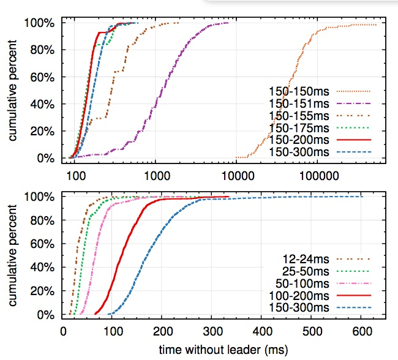

> 图 16：发现并替换一个已经崩溃的领导人的时间。上面的图考察了在选举超时时间上的随机化程度，下面的图考察了最小选举超时时间。每条线代表了 1000 次实验（除了 150-150 毫秒只试了 100 次），和相应的确定的选举超时时间。例如，150-155 毫秒意思是，选举超时时间从这个区间范围内随机选择并确定下来。这个实验在一个拥有 5 个节点的集群上进行，其广播时延大约是 15 毫秒。对于 9 个节点的集群，结果也差不多。

为了衡量领导人选举，我们反复的使一个拥有五个节点的服务器集群的领导人宕机，并计算需要多久才能发现领导人已经宕机并选出一个新的领导人（见图 16）。为了构建一个最坏的场景，在每一的尝试里，服务器都有不同长度的日志，意味着有些候选人是没有成为领导人的资格的。另外，为了促成选票瓜分的情况，我们的测试脚本在终止领导人之前同步的发送了一次心跳广播（这大约和领导人在崩溃前复制一个新的日志给其他机器很像）。领导人均匀的随机的在心跳间隔里宕机，也就是最小选举超时时间的一半。因此，最小宕机时间大约就是最小选举超时时间的一半。

图 16 中上面的图表明，只需要在选举超时时间上使用很少的随机化就可以大大避免选票被瓜分的情况。在没有随机化的情况下，在我们的测试里，选举过程往往都需要花费超过 10 秒钟由于太多的选票瓜分的情况。仅仅增加 5 毫秒的随机化时间，就大大的改善了选举过程，现在平均的宕机时间只有 287 毫秒。增加更多的随机化时间可以大大改善最坏情况：通过增加 50 毫秒的随机化时间，最坏的完成情况（1000 次尝试）只要 513 毫秒。

图 16 中下面的图显示，通过减少选举超时时间可以减少系统的宕机时间。在选举超时时间为 12-24 毫秒的情况下，只需要平均 35 毫秒就可以选举出新的领导人（最长的一次花费了 152 毫秒）。然而，进一步降低选举超时时间的话就会违反 Raft 的时间不等式需求：在选举新领导人之前，领导人就很难发送完心跳包。这会导致没有意义的领导人改变并降低了系统整体的可用性。我们建议使用更为保守的选举超时时间，比如 150-300 毫秒；这样的时间不大可能导致没有意义的领导人改变，而且依然提供不错的可用性。

## 10 相关工作

已经有很多关于一致性算法的工作被发表出来，其中很多都可以归到下面的类别中：

* Lamport 关于 Paxos 的原始描述，和尝试描述的更清晰。
* 关于 Paxos 的更详尽的描述，补充遗漏的细节并修改算法，使得可以提供更加容易的实现基础。
* 实现一致性算法的系统，例如 Chubby，ZooKeeper 和 Spanner。对于 Chubby 和 Spanner 的算法并没有公开发表其技术细节，尽管他们都声称是基于 Paxos 的。ZooKeeper 的算法细节已经发表，但是和 Paxos 着实有着很大的差别。
* Paxos 可以应用的性能优化。
* Oki 和 Liskov 的 Viewstamped Replication（VR），一种和 Paxos 差不多的替代算法。原始的算法描述和分布式传输协议耦合在了一起，但是核心的一致性算法在最近的更新里被分离了出来。VR 使用了一种基于领导人的方法，和 Raft 有很多相似之处。

Raft 和 Paxos 最大的不同之处就在于 Raft 的强领导特性：Raft 使用领导人选举作为一致性协议里必不可少的部分，并且将尽可能多的功能集中到了领导人身上。这样就可以使得算法更加容易理解。例如，在 Paxos 中，领导人选举和基本的一致性协议是正交的：领导人选举仅仅是性能优化的手段，而且不是一致性所必须要求的。但是，这样就增加了多余的机制：Paxos 同时包含了针对基本一致性要求的两阶段提交协议和针对领导人选举的独立的机制。相比较而言，Raft 就直接将领导人选举纳入到一致性算法中，并作为两阶段一致性的第一步。这样就减少了很多机制。

像 Raft 一样，VR 和 ZooKeeper 也是基于领导人的，因此他们也拥有一些 Raft 的优点。但是，Raft 比 VR 和 ZooKeeper 拥有更少的机制因为 Raft 尽可能的减少了非领导人的功能。例如，Raft 中日志条目都遵循着从领导人发送给其他人这一个方向：附加条目 RPC 是向外发送的。在 VR 中，日志条目的流动是双向的（领导人可以在选举过程中接收日志）；这就导致了额外的机制和复杂性。根据 ZooKeeper 公开的资料看，它的日志条目也是双向传输的，但是它的实现更像 Raft。

和上述我们提及的其他基于一致性的日志复制算法中，Raft 的消息类型更少。例如，我们数了一下 VR 和 ZooKeeper 使用的用来基本一致性需要和成员改变的消息数（排除了日志压缩和客户端交互，因为这些都比较独立且和算法关系不大）。VR 和 ZooKeeper 都分别定义了 10 种不同的消息类型，相对的，Raft 只有 4 种消息类型（两种 RPC 请求和对应的响应）。Raft 的消息都稍微比其他算法的要信息量大，但是都很简单。另外，VR 和 ZooKeeper 都在领导人改变时传输了整个日志；所以为了能够实践中使用，额外的消息类型就很必要了。

Raft 的强领导人模型简化了整个算法，但是同时也排斥了一些性能优化的方法。例如，平等主义 Paxos （EPaxos）在某些没有领导人的情况下可以达到很高的性能。平等主义 Paxos 充分发挥了在状态机指令中的交换性。任何服务器都可以在一轮通信下就提交指令，除非其他指令同时被提出了。然而，如果指令都是并发的被提出，并且互相之间不通信沟通，那么 EPaxos 就需要额外的一轮通信。因为任何服务器都可以提交指令，所以 EPaxos 在服务器之间的负载均衡做的很好，并且很容易在 WAN 网络环境下获得很低的延迟。但是，他在 Paxos 上增加了非常明显的复杂性。

一些集群成员变换的方法已经被提出或者在其他的工作中被实现，包括 Lamport 的原始的讨论，VR 和 SMART。我们选择使用共同一致的方法因为他对一致性协议的其他部分影响很小，这样我们只需要很少的一些机制就可以实现成员变换。Lamport 的基于 α 的方法之所以没有被 Raft 选择是因为它假设在没有领导人的情况下也可以达到一致性。和 VR 和 SMART 相比较，Raft 的重新配置算法可以在不限制正常请求处理的情况下进行；相比较的，VR 需要停止所有的处理过程，SMART 引入了一个和 α 类似的方法，限制了请求处理的数量。Raft 的方法同时也需要更少的额外机制来实现，和 VR、SMART 比较而言。

## 11 结论

算法的设计通常会把正确性，效率或者简洁作为主要的目标。尽管这些都是很有意义的目标，但是我们相信，可理解性也是一样的重要。在开发者把算法应用到实际的系统中之前，这些目标没有一个会被实现，这些都会必然的偏离发表时的形式。除非开发人员对这个算法有着很深的理解并且有着直观的感觉，否则将会对他们而言很难在实现的时候保持原有期望的特性。

在这篇论文中，我们尝试解决分布式一致性问题，但是一个广为接受但是十分令人费解的算法 Paxos 已经困扰了无数学生和开发者很多年了。我们创造了一种新的算法 Raft，显而易见的比 Paxos 要容易理解。我们同时也相信，Raft 也可以为实际的实现提供坚实的基础。把可理解性作为设计的目标改变了我们设计 Raft 的方式；随着设计的进展，我们发现自己重复使用了一些技术，比如分解问题和简化状态空间。这些技术不仅提升了 Raft 的可理解性，同时也使我们坚信其正确性。

## 12 感谢

这项研究必须感谢以下人员的支持：Ali Ghodsi，David Mazie\`res，和伯克利 CS 294-91 课程、斯坦福 CS 240 课程的学生。Scott Klemmer 帮我们设计了用户调查，Nelson Ray 建议我们进行统计学的分析。在用户调查时使用的关于 Paxos 的幻灯片很大一部分是从 Lorenzo Alvisi 的幻灯片上借鉴过来的。特别的，非常感谢 DavidMazieres 和 Ezra Hoch，他们找到了 Raft 中一些难以发现的漏洞。许多人提供了关于这篇论文十分有用的反馈和用户调查材料，包括 Ed Bugnion，Michael Chan，Hugues Evrard，Daniel Giffin，Arjun Gopalan，Jon Howell，Vimalkumar Jeyakumar，Ankita Kejriwal，Aleksandar Kracun，Amit Levy，Joel Martin，Satoshi Matsushita，Oleg Pesok，David Ramos，Robbert van Renesse，Mendel Rosenblum，Nicolas Schiper，Deian Stefan，Andrew Stone，Ryan Stutsman，David Terei，Stephen Yang，Matei Zaharia 以及 24 位匿名的会议审查人员（可能有重复），并且特别感谢我们的领导人 Eddie Kohler。Werner Vogels 发了一条早期草稿链接的推特，给 Raft 带来了极大的关注。我们的工作由 Gigascale 系统研究中心和 Multiscale 系统研究中心给予支持，这两个研究中心由关注中心研究程序资金支持，一个是半导体研究公司的程序，由 STARnet 支持，一个半导体研究公司的程序由 MARCO 和 DARPA 支持，在国家科学基金会的 0963859 号批准，并且获得了来自 Facebook，Google，Mellanox，NEC，NetApp，SAP 和 Samsung 的支持。Diego Ongaro 由 Junglee 公司，斯坦福的毕业团体支持。

## 参考

略
